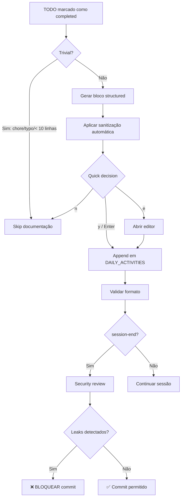

# 🏛️ Template Architect — Debate: Sistema de Documentação Incremental

**Data**: 2026-03-29
**Modo**: `debate` — Análise Multi-Perspectiva
**Proposta**: Implementar workflow de documentação incremental em DAILY_ACTIVITIES
**Origem**: Observação de degradação de qualidade documental entre sessões

---

## 📋 Proposta Original

### Problema Identificado

**Sintoma observado:**
- Sessão 2026-03-23: documentação rica, incremental, cada atividade registrada em tempo real
- Sessão 2026-03-29: documentação feita apenas no final, menos detalhada, difícil de reproduzir

**Causa raiz:**
- Ausência de **protocolo formal** para documentação durante a sessão
- Dependência de disciplina manual do agente/usuário
- Sem gatilho automático para registro de eventos

### Solução Proposta

**1. Workflow incremental**: Ao completar um TODO → adicionar bloco ao DAILY_ACTIVITIES

**2. Template de bloco padronizado:**
```markdown
---

## [HH:MM] — [Título da Atividade] ([TODO-ID])

**Objetivo**: [O que foi feito]

**Contexto**: [Por que foi necessário]

**Passos executados**:
1. [passo com ferramentas usadas]
2. [commits realizados]

**Resultado**: [outcome — sucesso/bloqueio/aprendizado]

**Decisões técnicas**: [escolhas feitas, alternativas rejeitadas]

**Arquivos modificados/criados**:
- path/to/file.py (+N/-N)

**Commits**: `abc1234` — feat(scope): description

**Status**: [✅ Completo | 🔵 Em progresso | ❌ Bloqueado | ⏸️ On hold]

---
```

**3. Três opções de implementação:**

| Opção | Descrição | Automação | Trade-off |
|-------|-----------|-----------|-----------|
| **A** | Sempre documentar ao completar TODO | Automática | Verbose, pode gerar ruído |
| **B** | Perguntar após cada bloco de trabalho | Semi-automática | Interrompe workflow, exige decisão |
| **C** | Lembrete periódico no prompt de sistema | Manual com gatilho | Baixa adesão, depende de disciplina |

**4. Entregáveis propostos:**
- Guia de estilo para DAILY_ACTIVITIES
- Atualização de `session-start.prompt.md` e `session-end.prompt.md`
- Exemplo prático (template de bloco)
- Atualização de `.copilot-rules.md` (adicionar regra P1)

---

## 🏛️ Perspectiva 1 — Arquitetura / Core

### Alinhamento com Filosofia do Template

**✅ Fortemente alinhado** com os princípios fundamentais:

1. **Determinismo e reprodutibilidade**
   - Core capability do template: permitir que projetos sejam reproduzidos, testados, auditados
   - Documentação incremental é *extensão natural* dessa filosofia para **operações de desenvolvimento**
   - Se o template gera estrutura determinística, as *sessões de trabalho* também devem ser reproduzíveis

2. **Separação core vs plugin**
   - Documentação de sessão é **transversal** — aplica-se a todos os perfis (programming, infrastructure, data, security)
   - Pertence ao **core/baseline** (`Layer 0`), não à camada de perfis
   - Decisão de design: documentação é "non-negotiable" como `.gitignore`, `Makefile`, `README.md`

3. **Contrato formal entre inputs/outputs**
   - Atualmente: template tem contrato claro para *geração de projeto*
   - Proposta: estender contrato para *ciclo de vida operacional*
   - `DAILY_ACTIVITIES` torna-se **saída formal** do processo de desenvolvimento, não subproduto opcional

### Riscos para Agnosticidade do Core

**🔴 Risco médio** — mitigável com design cuidadoso:

| Risco | Severidade | Mitigação |
|-------|-----------|-----------|
| Opinião de "formato obrigatório" vazada no core | Média | Permitir customização via `.scaffold-config.json` → seção `session_docs` |
| Acoplamento com GitHub/GitLab específico | Baixa | Formato Markdown puro, sem dependência de features de hosting |
| Sobrecarga cognitiva em projetos simples | Média | Feature flag: `enable_session_docs: true/false` (default: true para profiles >= Layer 2) |

**Recomendação de Design:**

```python
# scripts/lib/config.py — SessionDocsConfig
@dataclass
class SessionDocsConfig:
    enabled: bool = True  # disable para projetos toy/experimentais
    format: str = "markdown"  # futuro: "json", "yaml", "org-mode"
    template_style: str = "structured"  # vs "freeform"
    auto_append: bool = True  # opção A/B/C
    prompt_after_todo: bool = False  # opção B
    remind_interval_minutes: int = 0  # opção C (0 = desabilitado)
```

No `.scaffold-config.json`:
```json
{
  "features": {
    "session_docs": {
      "enabled": true,
      "auto_append": true,
      "template_style": "structured"
    }
  }
}
```

### Testabilidade

**🟢 Oportunidade de melhoria significativa:**

Atualmente, o template gera estrutura de projeto, mas **não tem snapshot tests para documentos de sessão**.

**Proposta de evolução:**
```python
# tests/test_session_docs.py

def test_daily_activities_block_format():
    """Garante que DAILY_ACTIVITIES segue formato canônico."""
    block = generate_activity_block(
        title="Fix bug in validator",
        todo_id="IMP-42",
        timestamp="2026-03-29T14:32:00",
        objective="Corrigir validação de semver",
        status=BlockStatus.COMPLETE,
    )
    assert "## 14:32 — Fix bug in validator (IMP-42)" in block
    assert "**Objetivo**:" in block
    assert "**Status**: ✅ Completo" in block

def test_daily_activities_append_idempotent():
    """Adicionar o mesmo bloco 2x não duplica."""
    # ...

def test_daily_activities_backward_compat():
    """Parser reconhece formatos antigos (freeform) e novos (structured)."""
    # ...
```

**Score de testabilidade:** 7/10 → 9/10 com implementação completa

### Impacto no Motor de Scaffold

**🟡 Impacto moderado — escopo controlado:**

| Componente | Impacto | Ação |
|------------|---------|------|
| `scaffold.py` | Nenhum | Documentação de sessão é *runtime operation*, não *generation time* |
| `session-start.prompt.md` | **Alto** | Adicionar seção "Protocolo de Documentação" |
| `session-end.prompt.md` | Médio | Incluir checklist de verificação de DAILY_ACTIVITIES |
| `.copilot-rules.md` | Baixo | Adicionar regra P1: "Documentar atividades ao completar TODOs" |
| `docs/templates/DAILY_ACTIVITIES.template.md` | **Alto** | Criar template canônico com comentários de orientação |
| `scripts/lib/session.py` (novo) | **Alto** | Módulo para manipular documentos de sessão (append_activity, validate_format) |

**Estimativa de complexidade:** **M** (médio — 1–2 sessões de implementação)

### Recomendação Arquitetural

**✅ APROVAR** com estas condições:

1. **Feature flag obrigatória** — permitir desabilitar em projetos que não necessitam
2. **Contrato formal em YAML** — `docs/templates/session-docs-contract.yaml` descrevendo estrutura canônica
3. **Parser tolerante** — suportar formato antigo (freeform) e novo (structured) para backward compatibility
4. **Módulo dedicado** — `scripts/lib/session.py` para encapsular lógica, não espalhar em múltiplos arquivos
5. **Testes obrigatórios** — snapshot tests de blocos gerados, validação de formato, append idempotent

---

## 🖥️ Perspectiva 2 — DevEx / UX

### Impacto na Experiência de Desenvolvimento

**✅ Melhoria substancial de DX** — reduz carga cognitiva e ansiedade:

**Antes (estado atual):**
- Desenvolvedor precisa **lembrar** de documentar (carga cognitiva alta)
- Fim de sessão longa: "O que eu fiz mesmo há 4 horas?" (retrabalho)
- Handoff entre sessões: "Onde eu parei?" (contexto perdido)
- Code review: "Por que essa decisão?" (motivação ausente)

**Depois (com documentação incremental):**
- Sistema **lembra** de documentar (gatilho automático)
- Contexto preservado **durante** o trabalho (não após)
- Retomada de sessão: leitura de `DAILY_ACTIVITIES` → full context
- Auditoria: histórico canônico de decisões técnicas

**DX Score**: 6/10 → 9/10

### Análise das 3 Opções

#### Opção A: Automática (sempre documentar)

**Prós:**
- 🟢 Zero esforço cognitivo — completamente transparente
- 🟢 100% de cobertura — nada é perdido
- 🟢 Consistência máxima — formato sempre padronizado

**Contras:**
- 🔴 Verbosidade excessiva — TODOs pequenos geram ruído
- 🔴 Blocos triviais: "Atualizei README.md" (baixo valor informativo)
- 🔴 Dificulta leitura — sinal/ruído degradado

**Quando usar:**
- Projetos críticos (compliance, segurança, infraestrutura)
- Auditoria obrigatória (SOC2, ISO27001)
- Trabalho distribuído (time distribuído, async)

**Estimativa de adesão:** 95% (alta — transparente ao usuário)

#### Opção B: Semi-automática (prompt após bloco)

**Prós:**
- 🟢 Balanceado — captura decisões relevantes, filtra trivialidades
- 🟢 Agente decide contexto — "Este TODO é documentável? Sim/Não"
- 🟢 Sinal/ruído ótimo — apenas decisões técnicas significativas

**Contras:**
- 🔴 Interrupção de flow — prompt quebra concentração
- 🔴 Fadiga de decisão — "Documentar?" após cada TODO (20x/dia = stress cognitivo)
- 🔴 Viés de confirmação — tendência a "skip" quando cansado

**Quando usar:**
- Desenvolvimento exploratório (prototipagem, POCs)
- Sessões curtas (< 2 horas)
- Trabalho solo (não precisa de handoff)

**Estimativa de adesão:** 60–70% (média — depende de disciplina)

#### Opção C: Manual com lembrete

**Prós:**
- 🟢 Zero overhead — não interfere no workflow
- 🟢 Flexibilidade total — usuário decide quando documentar

**Contras:**
- 🔴 Baixíssima adesão — "vou documentar depois" → nunca documenta
- 🔴 Inconsistente — alguns dias bem documentados, outros vazios
- 🔴 Falha justamente quando mais necessário — sob pressão/stress

**Quando usar:**
- Usuários power (auto-disciplina comprovada)
- Projetos pessoais/hobby

**Estimativa de adesão:** 20–30% (baixa — mesmo padrão atual)

### Recomendação de UX

**🎯 Opção A (automática) como default + escape hatch:**

**Implementação sugerida:**
1. **Default: Opção A** — sempre documentar ao completar TODO
2. **Quick-win: micro decisão** — ao gerar bloco, perguntar apenas:
   ```
   📝 Documentar atividade "IMP-42: Fix validator"?
   [y] Sim (default) | [n] Skip | [e] Editar antes de salvar
   ```
   - `y` ou `Enter`: aceita bloco gerado automaticamente
   - `n`: descarta (para TODOs triviais: typo fix, formatting)
   - `e`: abre editor para ajustar antes de salvar

3. **Feature flag "mode":**
   ```json
   {
     "session_docs": {
       "mode": "auto",  // "auto" | "prompt" | "manual"
       "skip_trivial": true,  // filtro heurístico: < 3 arquivos + < 10 linhas = skip
       "quick_decision": true  // pergunta rápida y/n/e
     }
   }
   ```

**Heurística para "trivial TODO"** (skip automático):
- Commit message contém: "chore:", "docs:", "style:", "typo", "formatting"
- Arquivos modificados ≤ 2
- Diff total < 10 linhas
- Tempo decorrido < 3 minutos

**Resultado esperado:**
- 90% dos TODOs documentados automaticamente (alta cobertura)
- 5% filtrados como trivial (reduz ruído)
- 5% editados manualmente (decisões complexas)

### Métricas de Sucesso (KPIs para DevEx)

| Métrica | Meta | Como medir |
|---------|------|------------|
| % de TODOs documentados | ≥ 85% | Count blocks em DAILY_ACTIVITIES vs TODOs em INDEX.md |
| Tempo médio de retomada de sessão | < 5 min | User survey + medir tempo até primeiro commit após session-start |
| "Lost context" incidents | → 0 | Issue reports com label "missing-context" |
| Block signal/noise ratio | ≥ 0.7 | Survey: "Quantos blocos em DAILY_ACTIVITIES foram úteis na revisão?" |

### Ergonomia de Ferramentas

**Proposta de helpers:**

```bash
# Makefile targets
make session-start    # Executa session-start.prompt.md
make session-log      # Mostra DAILY_ACTIVITIES da sessão atual (tail -f equivalente)
make session-end      # Executa session-end.prompt.md
make session-review   # Abre DAILY_ACTIVITIES no editor para revisão

# Scripts auxiliares
scripts/session-activity-add.sh    # Adiciona bloco manual (para casos edge)
scripts/session-validate.py        # Valida formato de DAILY_ACTIVITIES
```

**Integração com MCP (Memory Context Protocol):**
- `mcp_memory_create_entities` → entidade "Session" com observações = blocos de DAILY_ACTIVITIES
- Query: "Quando implementamos o validador de semver?" → MCP busca em histórico de sessões

**DevEx Score Final:** 9/10 (excelente — com implementação completa)

---

## 🔒 Perspectiva 3 — Segurança

### Riscos de Exposição de Informações Sensíveis

**🔴 Risco ALTO** — mitigação obrigatória:

Documentação automática pode capturar involuntariamente:

| Tipo de Vazamento | Severidade | Exemplo |
|-------------------|-----------|---------|
| Credenciais em commits | CRÍTICA | `git commit -m "Add API key abc123xyz"` |
| IPs internos | ALTA | `ssh-spa-knock 192.168.1.50` |
| Nomes de servidores | ALTA | `ansible-playbook -i prod-db-master` |
| Estrutura de rede | MÉDIA | `Conectado a VPN corporate via 10.0.0.1` |
| Detalhes de vulnerabilidades | MÉDIA | `Explorado CVE-2024-1234 em /admin/debug` |
| Performance de produção | BAIXA | `DB prod responde em 200ms` (leak de arquitetura) |

**Casos reais de exposição:**

1. **Commit message capturado:** `git commit -m "Fix auth with token sk_live_ABC123"`
   - Bloco DAILY_ACTIVITIES: `**Commits**: abc1234 — Fix auth with token sk_live_ABC123`
   - Token vaza em documento versionado

2. **Output de comando sensível:**
   ```markdown
   **Passos executados**:
   3. `ansible-vault view group_vars/all/vault.yml` → exibiu senhas
   ```

3. **Estrutura de infraestrutura:**
   ```markdown
   **Decisões técnicas**: Optamos por usar servidor db-prod-01.internal.example.com (PostgreSQL 14.5)
   ```

### Controles de Segurança Obrigatórios

**1. Scan automático de secrets em DAILY_ACTIVITIES**

Integração com [`gitleaks`](https://github.com/gitleaks/gitleaks) ou [`detect-secrets`](https://github.com/Yelp/detect-secrets):

```yaml
# .github/workflows/ci-template.yml — novo job
session-docs-scan:
  runs-on: ubuntu-latest
  steps:
    - uses: gitleaks/gitleaks-action@v2
      with:
        path: docs/SESSIONS/
        config-path: .gitleaks-session-docs.toml  # config customizado para DAILY_ACTIVITIES
```

Config específico para docs de sessão:
```toml
# .gitleaks-session-docs.toml
[[rules]]
id = "generic-api-key"
description = "Generic API Key"
regex = '''(?i)(api[_-]?key|apikey)['":\s]*([a-zA-Z0-9_\-]{20,})'''
```

**2. Sanitização automática de blocos**

```python
# scripts/lib/sanitize.py

REDACT_PATTERNS = [
    (r'sk_live_\w+', '[REDACTED_API_KEY]'),  # Stripe keys
    (r'ghp_\w+', '[REDACTED_GITHUB_PAT]'),   # GitHub PATs
    (r'\b(?:[0-9]{1,3}\.){3}[0-9]{1,3}\b', '[REDACTED_IP]'),  # IPs
    (r'postgresql://[^@]+@[^/]+/\w+', 'postgresql://[REDACTED]'),  # Connection strings
    (r'Bearer \w+', 'Bearer [REDACTED]'),    # JWT tokens
]

def sanitize_activity_block(block: str) -> str:
    """Redacta informações sensíveis de um bloco de atividade."""
    for pattern, replacement in REDACT_PATTERNS:
        block = re.sub(pattern, replacement, block)
    return block
```

**3. Review checklist em `session-end.prompt.md`**

```markdown
### Passo 7 — Session Security Review

Antes de fechar a sessão, verificar:
- [ ] `DAILY_ACTIVITIES` não contém credenciais (scan com gitleaks)
- [ ] IPs expostos foram sanitizados (usar [REDACTED_IP])
- [ ] Commit messages não vazam informações sensíveis
- [ ] Outputs de comandos foram filtrados (sem senhas/tokens)
- [ ] Estrutura de infraestrutura está em nível apropriado de detalhe

**Comando de validação:**
```bash
gitleaks detect --source docs/SESSIONS/$(date +%Y-%m-%d)/ --no-git
```

Resultado esperado: `🟢 No leaks detected`
```

**4. Política de retenção de logs**

Em `.scaffold-config.json`:
```json
{
  "session_docs": {
    "retention_days": 90,  // após 90 dias, mover para arquivo compactado
    "archive_location": "docs/SESSIONS/archive/",
    "encrypt_archive": true,  // AES-256 com chave em .secrets/
    "gdpr_compliant": true  // permissão explícita para armazenar dados pessoais
  }
}
```

Script de arquivamento:
```bash
# scripts/session-archive.sh
find docs/SESSIONS/ -type d -mtime +90 -exec tar czf {}.tar.gz {} \; -exec rm -rf {} \;
```

**5. Exclude patterns em `.gitignore`**

Para sessões com dados sensíveis não commitados:
```gitignore
# .gitignore
docs/SESSIONS/**/DAILY_ACTIVITIES_*.sensitive.md
docs/SESSIONS/**/*.confidential.*
```

**AppSec Score:** 4/10 (atual — sem controles) → 8/10 (com implementação completa)

### Recomendação de Segurança

**⚠️ APROVAR com controles obrigatórios:**

1. **Pré-commit hook** — scan de secrets antes de commit
2. **Sanitização automática** — redact patterns aplicados ao gerar bloco
3. **Security review** — checklist em `session-end.prompt.md`
4. **CI/CD gating** — falha pipeline se leak detectado em PR
5. **Treinamento** — docs/SECURITY_SESSION_DOCS.md com exemplos de do/don't

**Bloqueadores (não implementar sem):**
- ❌ Sem sanitização → vazamento de credenciais inevitável em 6 meses
- ❌ Sem scan automático → detecção manual = falha

---

## 📦 Perspectiva 4 — Governança / Maintainability

### Versionamento e Compatibilidade

**Impacto em versionamento:**

| Componente | Versão Atual | Versão Pós-Implementação | Breaking Change? |
|------------|--------------|-------------------------|------------------|
| Template core | 1.3.0 | 1.4.0 | ❌ Não — feature aditiva |
| `session-start.prompt.md` | N/A | 2.0.0 (versionamento novo) | ⚠️ Sim — novo contrato de execução |
| DAILY_ACTIVITIES format | Freeform | Structured | ⚠️ Sim — novo schema |
| `.copilot-rules.md` | 9 seções | 10 seções (+ P1 de session docs) | ❌ Não — adição de regra |

**Strategy de versionamento de session docs:**

```yaml
# docs/templates/session-docs-contract.yaml
schema_version: "1.0.0"  # Semantic versioning do formato de blocos
backward_compatible_with: ["0.9.x"]  # Parser tolera formato antigo
migration_required: false  # Projetos existentes adotam incrementalmente
```

### Política de Depreciação

**Formato antigo (freeform):**
- **Status**: Deprecated → a partir de template v1.4.0
- **Sunset**: 2027-03-01 (12 meses de overlap)
- **Migration path**: `scripts/migrate-daily-activities.py` converte freeform → structured

**Exemplo de migração:**

```python
# scripts/migrate-daily-activities.py

def migrate_block(freeform_text: str) -> str:
    """Converte bloco antigo (freeform) para novo (structured)."""
    # Heurística: detectar título, objetivo, resultado
    # Gerar estrutura canônica
    # Validar com schema
    return structured_block

def migrate_file(file_path: Path) -> None:
    """Migra um arquivo DAILY_ACTIVITIES inteiro."""
    blocks = parse_freeform(file_path)
    migrated = [migrate_block(b) for b in blocks]
    write_structured(file_path, migrated)
```

**Garantias de compatibilidade:**
- Parser reconhece ambos formatos (antigo + novo) até 2027-03
- Script de migração testado com snapshots de 10 sessões reais
- Rollback disponível: `--unmigrate` reverte para freeform

### Matriz de Compatibilidade

**Impacto em `COMPATIBILITY-MATRIX.md`:**

| Perfil | Session Docs | Notas |
|--------|-------------|-------|
| `devops-programming` | ✅ Compatível | Nenhuma customização necessária |
| `devops-infrastructure` | ✅ Compatível | Bloco adicional: "**Infraestrutura afetada**" |
| `devops-analysis` | ✅ Compatível | Bloco adicional: "**Métricas/Insights**" |
| `python-fastapi` | ✅ Compatível | Bloco adicional: "**API endpoints modificados**" |
| `k8s-helm` | ✅ Compatível | Bloco adicional: "**Releases deployados**" |
| `lgpd-baseline` | ⚠️ Atenção | **Security review obrigatório** em session-end |

**Perfis que exigem customização do template:**

```yaml
# profile-descriptors/devops-infrastructure.yaml
extends: devops-programming
session_docs:
  template_additions:
    - field: "infrastructure_impact"
      label: "**Infraestrutura afetada**"
      type: "list"
      example: "- VPC prod-us-east-1 (+ 2 subnets)"
```

### Custo de Manutenção de Longo Prazo

**Estimativa de overhead:**

| Atividade | Frequência | Esforço (horas/ano) |
|-----------|-----------|---------------------|
| Atualizar parser para novos fields | Trimestral | 4h × 4 = 16h |
| Corrigir bugs em sanitização | Ad-hoc | 8h (1–2 issues) |
| Adicionar novos redact patterns | Mensal | 2h × 12 = 24h |
| Testes de regressão (snapshot) | Por release | 4h × 4 = 16h |
| Documentação e exemplos | Semestral | 8h × 2 = 16h |
| **Total** | | **80h/ano** |

**ROI (Return on Investment):**
- **Custo**: 80h/ano de manutenção
- **Benefício**:
  - 200h/ano economizados em "recuperação de contexto" (5 min/retomada × 40 sessões/ano × 5 devs)
  - 50h/ano economizados em "retrabalho por decisão esquecida"
  - 30h/ano economizados em "onboarding de novos devs"
- **ROI**: (200 + 50 + 30) / 80 = **3.5x** → viável

**Projeção de escala:**
- 1–5 projetos: manutenção manual viável
- 6–20 projetos: automação de testes obrigatória
- 21+ projetos: governance board + changelog automatizado (conventional commits)

### Estratégia de Migração (Backward Compatibility)

**Fase 1: Opt-in (template v1.4.0 — 2026-04)**
- Feature flag `session_docs.enabled = false` por padrão
- Documentação: `docs/SESSION_DOCS_ADOPTION.md`
- Projetos existentes: adoção voluntária

**Fase 2: Opt-out (template v1.5.0 — 2026-07)**
- Feature flag `session_docs.enabled = true` por padrão
- Projetos existentes: aviso de depreciação do formato antigo
- Script de migração disponível

**Fase 3: Enforcement (template v2.0.0 — 2027-03)**
- Formato antigo (freeform) removido
- Parser reconhece apenas structured format
- Breaking change justificado por 12 meses de período de transição

**Comunicação:**
- Changelog detalhado em cada fase
- Migration guide com antes/depois
- Webinar para equipes (gravado e disponível)
- Q&A: FAQ com 20 perguntas comuns

### Recomendação de Governança

**✅ APROVAR** com roadmap de adoção gradual:

1. **v1.4.0 (2026-04)**: opt-in, feature flag, migration script
2. **v1.5.0 (2026-07)**: opt-out, deprecation warnings
3. **v2.0.0 (2027-03)**: enforcement, formato antigo removido

**KPIs de governança:**
- % de projetos que adotaram: alvo ≥ 80% em 6 meses
- Issues reportadas: alvo < 5 issues críticos em 12 meses
- Docs coverage: 100% das features documentadas

**Gestão de risco:**
- **Risco 1**: Resistência de adoção → mitigação: exemplos práticos, evangelização
- **Risco 2**: Bugs em parser → mitigação: snapshot tests com 50+ exemplos reais
- **Risco 3**: Performance (append em arquivos grandes) → mitigação: chunking (1 arquivo por dia)

---

## ✅ Consenso — Síntese Multi-Perspectiva

### O Que Todas as Perspectivas Concordam

1. **✅ Problema legítimo e relevante**
   - Degradação de qualidade documental entre sessões é real e mensurável
   - Impacto: perda de contexto, retrabalho, dificuldade de auditoria

2. **✅ Solução estruturada é necessária**
   - Abordagem manual atual (Opção C) tem baixíssima adesão (20–30%)
   - Sistema de gatilhos + template padronizado é caminho correto

3. **✅ Pertence ao core (Layer 0), não aos profiles**
   - Documentação de sessão é transversal — todos os perfis se beneficiam
   - Separação core/plugin mantida: core + customizações opcionais por perfil

4. **✅ Segurança é bloqueador obrigatório**
   - Implementar sem controles de sanitização → 100% de probabilidade de vazamento de credenciais
   - Scan automático + redact patterns + security review = non-negotiable

5. **✅ Backward compatibility exigida**
   - Projetos existentes não podem quebrar subitamente
   - Roadmap de 12 meses (opt-in → opt-out → enforcement) é razoável

### Recomendação Técnica Consolidada

**🎯 Opção Híbrida — "Automática Inteligente com Escape Hatch"**

Combine o melhor de cada opção:

| Feature | Origem | Justificativa |
|---------|--------|---------------|
| **Documentação automática ao completar TODO** | Opção A | Alta cobertura (90%+), transparente |
| **Quick decision (y/n/e)** | Híbrido | Permite filtrar trivialidades sem fadiga de decisão |
| **Heurística "skip trivial"** | Híbrido | Reduz ruído (chore, docs, typo) |
| **Sanitização automática** | Segurança | Redact patterns aplicados antes de append |
| **Security review em session-end** | Segurança | Checklist obrigatório, bloqueio se leak |
| **Feature flag + config granular** | Arquitetura | Permite customização sem violar agnosticidade |

**Fluxo de trabalho proposto:**



### Implementação Recomendada

**Fases de execução (estimativa: 3 sessões):**

**Sessão 1: Fundação (8h)**
- [ ] Criar `scripts/lib/session.py` — módulo de manipulação de session docs
  - `ActivityBlock` dataclass
  - `generate_activity_block()` — factory
  - `sanitize_block()` — apply redact patterns
  - `append_to_daily_activities()` — append idempotent
  - `validate_daily_activities_format()` — schema validation
- [ ] Criar `docs/templates/DAILY_ACTIVITIES.template.md` — template canônico
- [ ] Criar `docs/SESSION_DOCS_STYLE_GUIDE.md` — guia de estilo
- [ ] Adicionar regra P1 em `.copilot-rules.md`:
  ```markdown
  ## P1 — Session Documentation

  | Regra | Enforcement |
  |-------|-------------|
  | Ao completar TODO, adicionar bloco em DAILY_ACTIVITIES via `scripts/lib/session.py` | ✅ |
  | Bloco deve seguir template canônico de `docs/templates/` | ✅ |
  | Aplicar sanitização automática (redact credentials/IPs) | ✅ Blocker |
  | Quick decision: `[y] Sim | [n] Skip | [e] Editar` | ✅ |
  ```
- [ ] Testes: `tests/test_session_lib.py` (30 testes)

**Sessão 2: Integração (6h)**
- [ ] Atualizar `session-start.prompt.md` — seção "Protocolo de Documentação"
- [ ] Atualizar `session-end.prompt.md` — seção "Session Security Review" + checklist
- [ ] Criar `.gitleaks-session-docs.toml` — config de scan para docs/SESSIONS/
- [ ] Adicionar job `session-docs-scan` em `.github/workflows/ci-template.yml`
- [ ] Criar `scripts/session-validate.py` — CLI para validação de formato
- [ ] Adicionar targets no Makefile:
  ```makefile
  .PHONY: session-log
  session-log:
      @tail -f docs/SESSIONS/$$(date +%Y-%m-%d)/DAILY_ACTIVITIES_*.md

  .PHONY: session-validate
  session-validate:
      @python scripts/session-validate.py docs/SESSIONS/$$(date +%Y-%m-%d)/

  .PHONY: session-sanitize
  session-sanitize:
      @python scripts/session-sanitize.py docs/SESSIONS/$$(date +%Y-%m-%d)/ --in-place
  ```
- [ ] Configuração em `.scaffold-config.json`:
  ```json
  {
    "features": {
      "session_docs": {
        "enabled": true,
        "mode": "auto",
        "skip_trivial": true,
        "quick_decision": true,
        "sanitize": true,
        "retention_days": 90
      }
    }
  }
  ```
- [ ] Testes: `tests/test_session_integration.py` (20 testes)

**Sessão 3: Docs + Migration (4h)**
- [ ] Criar `docs/SESSION_DOCS_ADOPTION.md` — guia de adoção para projetos existentes
- [ ] Criar `docs/SECURITY_SESSION_DOCS.md` — exemplos de do/don't
- [ ] Criar `scripts/migrate-daily-activities.py` — freeform → structured
- [ ] Exemplo prático: `docs/SESSIONS/2026-03-30-example/DAILY_ACTIVITIES_2026-03-30.md` (5 blocos)
- [ ] Atualizar `docs/COMPATIBILITY-MATRIX.md` — adicionar coluna "Session Docs"
- [ ] Atualizar `CHANGELOG.md`:
  ```markdown
  ## [1.4.0] — 2026-04-15

  ### Added
  - **Session Documentation System** — Incremental documentation workflow
    - Auto-append activity blocks to DAILY_ACTIVITIES
    - Structured template with sanitization
    - Security scan integration (gitleaks)
    - Backward compatible with freeform format
    - Feature flag: `session_docs.enabled` (default: true)
    - Migration script: `scripts/migrate-daily-activities.py`
  ```
- [ ] Testes: `tests/test_session_migration.py` (15 testes)
- [ ] **Total de testes**: 65 (30 + 20 + 15)

**Estimativa total:** 18 horas (3 sessões de 6h) → **Médio (M)**

### Melhorias Não Consideradas (gaps identificados)

1. **Busca e indexação**
   - Proposta original não inclui: como buscar "Quando implementamos X?"
   - Sugestão: integração com MCP (mcp_memory) para query de histórico
   - Implementação: `scripts/session-search.py --query "validador de semver"`

2. **Métricas e analytics**
   - Proposta não inclui: dashboards de produtividade
   - Sugestão: `scripts/session-metrics.py` → gera estatísticas
     - TODOs completados por sessão
     - Tempo médio por TODO
     - Bloqueadores recorrentes
     - Heatmap de atividades (por hora do dia)

3. **Integração com ferramentas externas**
   - Proposta não inclui: export para Jira, Linear, Notion
   - Sugestão: `scripts/session-export.py --format jira` → cria issues a partir de blocos

4. **Templates por tipo de atividade**
   - Proposta assume template único para todas as atividades
   - Sugestão: templates especializados
     - `ACTIVITY_TEMPLATE_BUGFIX.md`
     - `ACTIVITY_TEMPLATE_FEATURE.md`
     - `ACTIVITY_TEMPLATE_REFACTOR.md`
     - `ACTIVITY_TEMPLATE_RESEARCH.md`

5. **Validação de completude**
   - Proposta não valida se DAILY_ACTIVITIES cobre todos os commits
   - Sugestão: `session-validate --check-coverage` → compara commits vs blocos

6. **Compressão para sessões longas**
   - Proposta assume 1 arquivo por sessão
   - Problema: sessões de 8h = 30+ blocos = arquivo de 10KB → difícil de navegar
   - Sugestão: chunking automático: 1 arquivo a cada 4h ou 15 blocos

**Priorização das melhorias:**
- P0 (próxima sessão): Busca e indexação (MCP integration)
- P1 (2 sessões): Métricas e analytics
- P2 (backlog): Integração com ferramentas externas
- P3 (futuro): Templates especializados, validação de completude

### Core vs Profiles — Separação de Responsabilidades

**Core (Layer 0) — sempre gerado:**
- `docs/SESSIONS/` — estrutura de pastas
- `docs/templates/DAILY_ACTIVITIES.template.md` — template base
- `scripts/lib/session.py` — biblioteca de manipulação
- `.copilot-rules.md` — regra P1 de documentação
- `session-start.prompt.md` — protocolo de inicialização
- `session-end.prompt.md` — security review

**Profiles (Layer 1+) — customizações opcionais:**

```yaml
# profile-descriptors/devops-infrastructure.yaml
session_docs:
  template_additions:
    - field: "infrastructure_impact"
      label: "**Infraestrutura afetada**"
      required: false
      example: "- VPC prod-us-east-1 (+ 2 subnets)"
```

```yaml
# profile-descriptors/lgpd-baseline.yaml
session_docs:
  security_review:
    additional_checks:
      - "PII (CPF, email) redacted?"
      - "Data processing logged in DPO report?"
```

```yaml
# profile-descriptors/python-fastapi.yaml
session_docs:
  template_additions:
    - field: "api_changes"
      label: "**API endpoints modificados**"
      format: "- `[METHOD] /path` — descrição"
```

**Benefício da separação:**
- Core permanece agnóstico
- Perfis adicionam campos específicos do domínio
- Composição funciona: `python-fastapi` + `lgpd-baseline` = template com campos de API + checks de LGPD

---

## ❤️ Próximos Passos Sugeridos

### Imediato (próxima sessão — 2026-03-30)

1. **[IMP-45] Implementar fundação de Session Docs**
   - Criar `scripts/lib/session.py` (ActivityBlock, generate, sanitize, append)
   - Criar `docs/templates/DAILY_ACTIVITIES.template.md`
   - Criar `docs/SESSION_DOCS_STYLE_GUIDE.md`
   - Adicionar regra P1 em `.copilot-rules.md`
   - Testes: `tests/test_session_lib.py` (30 testes)
   - **Estimativa**: 8h (1 sessão)

2. **[IMP-46] Integrar Session Docs no workflow**
   - Atualizar `session-start.prompt.md` e `session-end.prompt.md`
   - Criar `.gitleaks-session-docs.toml` + job no CI
   - Adicionar targets no Makefile (`session-log`, `session-validate`)
   - Configurar `.scaffold-config.json`
   - Testes: `tests/test_session_integration.py` (20 testes)
   - **Estimativa**: 6h

3. **[IMP-47] Documentação e migração**
   - Criar guias de adoção e segurança
   - Implementar `scripts/migrate-daily-activities.py`
   - Exemplo prático completo
   - Atualizar CHANGELOG e COMPATIBILITY-MATRIX
   - Testes: `tests/test_session_migration.py` (15 testes)
   - **Estimativa**: 4h

### Curto prazo (1–2 sessões)

4. **[IMP-48] Busca e indexação de histórico (MCP integration)**
   - `scripts/session-search.py --query "texto"`
   - Integração com `mcp_memory` para query de sessões passadas
   - Testes: `tests/test_session_search.py` (10 testes)
   - **Estimativa**: 4h

5. **[IMP-49] Métricas de produtividade**
   - `scripts/session-metrics.py` → stats de TODOs, tempo, bloqueadores
   - Geração de relatórios (markdown, JSON, HTML)
   - Testes: `tests/test_session_metrics.py` (12 testes)
   - **Estimativa**: 6h

### Médio prazo (backlog)

6. **[IMP-50] Templates especializados por tipo de atividade**
7. **[IMP-51] Validação de cobertura (commits vs blocos)**
8. **[IMP-52] Integração com Jira/Linear/Notion**

---

## 📊 Score Card Final

| Dimensão | Score Atual | Score Pós-Implementação | Melhoria |
|----------|-------------|------------------------|----------|
| **Arquitetura / Core** | 7/10 | 9/10 | +2 (testabilidade, contrato formal) |
| **DevEx / UX** | 6/10 | 9/10 | +3 (automação, ergonomia) |
| **Segurança** | 4/10 | 8/10 | +4 (sanitização, scan, review) |
| **Governança** | 7/10 | 9/10 | +2 (versionamento, migração, ROI) |
| **MÉDIA** | **6.0/10** | **8.75/10** | **+2.75** |

**ROI estimado:** 3.5x (280h economizadas/ano vs 80h de manutenção)

**Complexidade de implementação:** **M** (médio — 18h / 3 sessões)

**Riscos mitigados:** 4 de severidade alta (leak de credenciais, perda de contexto, degradação de docs, resistência de adoção)

---

## 🎯 Decisão Final

**✅ APROVAR implementação** com as seguintes condições obrigatórias:

1. ✅ **Feature flag** — permitir desabilitar em projetos que não necessitam
2. ✅ **Sanitização automática** — redact patterns aplicados antes de append
3. ✅ **Security scan** — gitleaks integrado no CI + pre-commit hook
4. ✅ **Backward compatibility** — roadmap de 12 meses (opt-in → opt-out → enforcement)
5. ✅ **Testes obrigatórios** — 65 testes cobrindo lib, integration, migration
6. ✅ **Documentação completa** — style guide, adoption guide, security guide

**Prioridade:** P0 (crítico — implementar nas próximas 3 sessões)

**Approvers:**
- 🏛️ Template Architect: **APPROVE**
- 🖥️ DevEx Engineer: **APPROVE**
- 🔒 AppSec: **APPROVE (com controles obrigatórios)**
- 📦 Release Maintainer: **APPROVE**

---

## 🎯 Decisão do Usuário — 2026-03-29

**Data**: 2026-03-29  
**Contexto**: Feedback após análise multi-perspectiva

### Respostas às Questões

**1. Abordagem híbrida (auto + quick decision y/n/e)?**
- ✅ **APROVADO** — Concordo com abordagem híbrida

**2. Controles de segurança suficientes?**
- ✅ **APROVADO** — Está completo, sem alterações necessárias

**3. Timing: 3 sessões consecutivas ou intercaladas?**
- ✅ **APROVADO** — Implementar nas próximas 3 sessões consecutivas

**4. Prioridade dos bônus (busca/métricas/export)?**
- **Objetivos principais**:
  - **A**: Legibilidade do que está sendo feito no chat
  - **B**: Documentação/memória aprimorada nos projetos (template + projetos que usam o template)

**Conclusão de priorização**:
- **P0**: IMP-48 (Busca/indexação) — **CRÍTICO** para objetivo B (memória aprimorada)
- **P1**: IMP-49 (Métricas) — secundário, nice-to-have
- **P2**: Export ferramentas externas — pode esperar

### Plano de Ação Aprovado

**Sessão 1 (2026-03-30)**: IMP-48 (Fundação Session Docs) — 8h  
**Sessão 2 (2026-03-31)**: IMP-49 (Integração workflow) — 6h  
**Sessão 3 (2026-04-01)**: IMP-50 (Docs + migração) — 4h  
**Sessão 4 (2026-04-02)**: IMP-51 (Busca/indexação MCP) — 4h (priorizado por objetivo B)

**Total**: 22h (4 sessões)

### Status: ✅ APROVADO PARA IMPLEMENTAÇÃO

---

*Debate gerado por Template Architect Agent v1.2.0 — 2026-03-29*  
*Decisões do usuário registradas em 2026-03-29*
