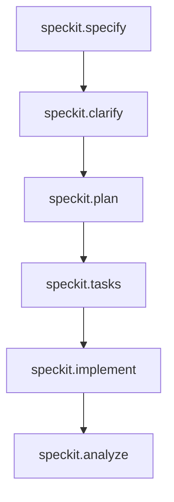
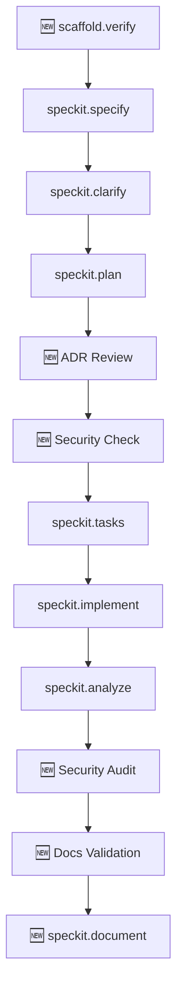

# 🔄 WORKFLOW SPECKIT ATUALIZADO — v2.0

**Data de Atualização**: 2026-04-07
**Versão Anterior**: v1.0 (workflow original)
**Versão Atual**: v2.0 (com verificações de segurança e conformidade)
**Contexto**: Análise de gaps do projeto yves-eti-br

---

## 📊 COMPARAÇÃO: V1.0 vs V2.0

### **V1.0 (Original)** — 6 Etapas



**Gaps identificados**:
- ❌ Sem verificação de conformidade do projeto gerado
- ❌ Sem validação de segurança (headers, hardening)
- ❌ Sem revisão de ADRs
- ❌ Sem verificação de estrutura de documentação
- ❌ Sem geração de resumo final

---

### **V2.0 (Atualizado)** — 8 Etapas + 4 Novos Agentes



**Melhorias**:
- ✅ Verificação de conformidade (pré-requisito)
- ✅ Revisão de ADRs durante planejamento
- ✅ Validação de segurança em duas etapas (plan + analyze)
- ✅ Validação de estrutura de documentação
- ✅ Geração de resumo final

---

## 🎯 WORKFLOW COMPLETO V2.0

### **ETAPA 0: Verificação de Scaffold** 🆕
**Agente**: `scaffold-verifier.agent.md`
**Comando**: `/scaffold.verify` ou automático no `session-manager`
**Quando**: Imediatamente após scaffold ou ao iniciar sessão

**Objetivo**: Garantir que o projeto foi gerado corretamente pelo scaffold

**Verificações**:
1. ✅ Templates copiados: `.specify/templates/`
2. ✅ Agentes copiados: `.github/agents/`
3. ✅ Prompts copiados: `.github/prompts/`
4. ✅ VS Code configurado: `.vscode/settings.json`, `mcp.json`, `extensions.json`
5. ✅ Workspace criado: `{project}.code-workspace`
6. ✅ Git inicializado: `.git/`, remote configurado
7. ✅ Secrets protegidos: `.secrets/`, `.gitignore` correto
8. ✅ Docs estruturados: `docs/debates/`, `docs/decisions/`, etc.
9. ✅ Segurança GitHub: `SECURITY.md`, `dependabot.yml`

**Outputs**:
- `docs/SCAFFOLD_VERIFICATION_REPORT.md` (gerado automaticamente)
- Status: ✅ COMPLIANT | ⚠️ GAPS DETECTED | ❌ CRITICAL ISSUES

**Bloqueio**: Se status = ❌, **impedir** execução de `/speckit.specify`

**Exemplo de uso**:
```
User: /scaffold.verify

Agent: 🔍 Verificando conformidade do projeto...

✅ Templates: 12/12 copiados
✅ Agentes: 11/11 copiados
❌ Segurança GitHub: 0/5 arquivos (CRÍTICO)
⚠️ Docs: 3/6 sub-pastas criadas

Status: ⚠️ GAPS DETECTED

Recomendação: Executar BUG-06 (arquivos de segurança) antes de continuar.
```

---

### **ETAPA 1: Especificação**
**Agente**: `speckit.specify.agent.md` (sem mudanças)
**Comando**: `/speckit.specify [descrição da feature]`

**Workflow**:
1. Criar branch feature (ex: `018-nome-da-feature`)
2. Gerar `.specify/specs/018-nome-da-feature/spec.md`
3. Validar checklist de completude
4. Marcar como ready para clarificação

**Sem mudanças nesta etapa.**

---

### **ETAPA 2: Clarificação**
**Agente**: `speckit.clarify.agent.md` (sem mudanças)
**Comando**: `/speckit.clarify`

**Workflow**:
1. Ler `spec.md`
2. Identificar underspecifications
3. Gerar até 5 perguntas de clarificação
4. Atualizar `spec.md` com respostas
5. Marcar como ready para planejamento

**Sem mudanças nesta etapa.**

---

### **ETAPA 3: Planejamento + ADR Review 🆕**
**Agentes**: `speckit.plan.agent.md` + `adr-reviewer.agent.md` (novo)
**Comando**: `/speckit.plan`

**Workflow**:

#### 3.1. Geração do Plan (Original)
1. Ler `spec.md`
2. Gerar `.specify/specs/{feature}/plan.md`
3. Incluir seções:
   - Architecture decisions
   - Component design
   - Data flow
   - API contracts
   - Testing strategy

#### 3.2. **ADR Review** 🆕 (Automático)
**Agente**: `adr-reviewer.agent.md`
**Trigger**: Após geração de `plan.md`

**Validações**:
1. ✅ Pelo menos 1 ADR documentado
2. ✅ Cada ADR tem: Contexto, Decisão, Consequências
3. ✅ Trade-offs explicitados
4. ✅ Alternativas consideradas

**Outputs**:
- Comentários inline no `plan.md` (se gaps)
- Status: ✅ APPROVED | ⚠️ IMPROVEMENTS NEEDED | ❌ INCOMPLETE

**Exemplo**:
```markdown
## Decision 1: Usar PostgreSQL

**Context**: Sistema precisa de ACID e queries complexas.

**Decision**: PostgreSQL 15

**Consequences**:
- ✅ Transactions robustas
- ✅ Full-text search nativo
- ❌ Maior complexidade de deploy vs SQLite

**Alternatives Considered**:
- MySQL: Descartado (FTS inferior)
- MongoDB: Descartado (sem ACID completo)

🤖 [ADR-REVIEWER]: ✅ ADR completo e bem justificado
```

#### 3.3. **Security Check** 🆕 (Automático)
**Agente**: `security-auditor.agent.md`
**Trigger**: Após ADR review

**Validações específicas**:

Para **features de frontend**:
- ✅ CSP (Content-Security-Policy) definida
- ✅ HSTS (Strict-Transport-Security) habilitado
- ✅ X-Frame-Options configurado
- ✅ Authentication strategy documentada
- ✅ Input validation strategy

Para **features de backend**:
- ✅ Authentication & authorization
- ✅ Rate limiting strategy
- ✅ SQL injection prevention
- ✅ Secrets management
- ✅ Logging & monitoring

**Outputs**:
- Seção `## Security` adicionada ao `plan.md`
- Checklist de hardening no `plan.md`
- Status: ✅ SECURE | ⚠️ IMPROVEMENTS | ❌ CRITICAL GAPS

**Exemplo**:
```markdown
## Security

### CSP Headers
```typescript
headers: [
  {
    key: 'Content-Security-Policy',
    value: "default-src 'self'; script-src 'self' 'unsafe-inline'; style-src 'self' 'unsafe-inline';"
  }
]
```

🤖 [SECURITY-AUDITOR]: ⚠️ CSP tem 'unsafe-inline' — considerar nonce-based CSP

### HSTS
```typescript
{ key: 'Strict-Transport-Security', value: 'max-age=63072000; includeSubDomains; preload' }
```

🤖 [SECURITY-AUDITOR]: ✅ HSTS configurado corretamente
```

**Bloqueio**: Se status = ❌, marcar plan como blocked até correções

---

### **ETAPA 4: Tarefas**
**Agente**: `speckit.tasks.agent.md` (sem mudanças)
**Comando**: `/speckit.tasks`

**Workflow**:
1. Ler `spec.md` + `plan.md`
2. Gerar `.specify/specs/{feature}/tasks.md`
3. Ordenar por dependências
4. Estimar complexidade

**Sem mudanças nesta etapa.**

---

### **ETAPA 5: Implementação**
**Agente**: `speckit.implement.agent.md` (sem mudanças)
**Comando**: `/speckit.implement`

**Workflow**:
1. Ler `tasks.md`
2. Executar tasks sequencialmente
3. Criar commits por task
4. Atualizar `tasks.md` com status

**Sem mudanças nesta etapa.**

---

### **ETAPA 6: Análise + Auditorias 🆕**
**Agentes**: `speckit.analyze.agent.md` + `security-auditor.agent.md` + `docs-structure-validator.agent.md`
**Comando**: `/speckit.analyze`

**Workflow**:

#### 6.1. Análise de Consistência (Original)
1. ✅ Spec vs código implementado
2. ✅ Plan vs tasks executadas
3. ✅ Tests vs especificação
4. ✅ Documentação vs features

#### 6.2. **Security Audit** 🆕 (Automático)
**Agente**: `security-auditor.agent.md`

**Validações práticas**:
1. **Headers HTTP**:
   ```bash
   curl -I https://yves.eti.br | grep -E "(Content-Security|Strict-Transport|X-Frame)"
   ```
   - ✅ CSP presente
   - ✅ HSTS presente
   - ✅ X-Frame-Options presente

2. **Dependências**:
   ```bash
   pnpm audit --audit-level=high
   ```
   - ✅ Zero vulnerabilidades high/critical

3. **Secrets**:
   ```bash
   git log --all -S "AKIA" -S "ghp_" -S "sk-" --oneline
   ```
   - ✅ Zero secrets commitados

4. **GitHub Hardening**:
   - ✅ `SECURITY.md` existe
   - ✅ `dependabot.yml` configurado
   - ✅ CodeQL workflow ativo (se aplicável)

**Outputs**:
- `docs/SECURITY_AUDIT_REPORT.md`
- Score: 0-100% (critical issues = 0%)
- Status: ✅ SECURE | ⚠️ IMPROVEMENTS | ❌ CRITICAL

#### 6.3. **Docs Validation** 🆕 (Automático)
**Agente**: `docs-structure-validator.agent.md`

**Validações**:
1. ✅ `docs/INDEX.md` atualizado
2. ✅ `docs/TODO.md` atualizado com feature
3. ✅ ADRs arquivados em `docs/decisions/`
4. ✅ Debates arquivados em `docs/debates/`
5. ✅ Guides criados se necessário (`docs/guides/`)
6. ✅ Links internos funcionam (sem 404)

**Outputs**:
- Lista de docs faltantes
- Sugestões de melhorias
- Status: ✅ COMPLETE | ⚠️ GAPS | ❌ MISSING CRITICAL

**Exemplo**:
```
📚 Validação de Documentação

✅ docs/INDEX.md — Atualizado com feature 018
✅ docs/TODO.md — Feature marcada como concluída
✅ docs/decisions/ADR-018-postgres-vs-mysql.md — Criado
⚠️ docs/guides/SETUP.md — Desatualizado (menciona versão antiga)
❌ docs/architecture/C4-CONTEXT.md — Ausente (recomendado para features complexas)

Status: ⚠️ GAPS DETECTED
Recomendação: Atualizar SETUP.md antes de merge.
```

---

### **ETAPA 7: Documentação Final** 🆕
**Agente**: `speckit.document.agent.md` (novo)
**Comando**: `/speckit.document` ou automático após `/speckit.analyze`

**Objetivo**: Gerar documentação completa da feature

**Outputs gerados**:

1. **`docs/features/FEATURE-018-nome.md`** (resumo da feature)
   ```markdown
   # Feature 018: Nome da Feature

   **Status**: ✅ Implementado
   **Branch**: 018-nome-da-feature
   **Merged**: 2026-04-08
   **PR**: #123

   ## Resumo
   [Descrição breve]

   ## Arquivos Modificados
   - src/module/file.ts
   - tests/module/file.test.ts

   ## ADRs Relacionados
   - [ADR-018: PostgreSQL vs MySQL](../decisions/ADR-018-postgres-vs-mysql.md)

   ## Próximos Passos
   - [ ] Monitorar performance em produção
   ```

2. **`docs/CHANGELOG.md`** (atualização)
   ```markdown
   ## [Unreleased]

   ### Added
   - Feature 018: Nome da feature (#123)

   ### Changed
   - [...]
   ```

3. **`docs/TODAY_ACTIVITIES.md`** (atualização)
   ```markdown
   ---
   ## 2026-04-08

   ### ✅ Feature 018 Implemented
   - Spec, plan, tasks executados
   - Security audit: ✅ PASSED
   - Docs validation: ✅ COMPLETE
   - Merged to main
   ```

**Exemplo de uso**:
```
User: /speckit.document

Agent: 📝 Gerando documentação final...

✅ docs/features/FEATURE-018-nome.md criado
✅ docs/CHANGELOG.md atualizado
✅ docs/TODAY_ACTIVITIES.md atualizado
✅ docs/INDEX.md atualizado com link para feature

Status: ✅ DOCUMENTATION COMPLETE
```

---

## 📋 CHECKLIST COMPLETO DO WORKFLOW V2.0

### Pré-requisitos (antes de `/speckit.specify`)
- [ ] 🆕 `/scaffold.verify` executado com status ✅ ou ⚠️

### Durante `/speckit.specify`
- [ ] Branch feature criada
- [ ] `spec.md` gerado
- [ ] Checklist de completude validado

### Durante `/speckit.clarify`
- [ ] Underspecifications identificadas
- [ ] Perguntas respondidas
- [ ] `spec.md` atualizado

### Durante `/speckit.plan`
- [ ] `plan.md` gerado
- [ ] 🆕 ADRs revisados (pelo menos 1)
- [ ] 🆕 Security checklist completo
- [ ] 🆕 Gaps de segurança resolvidos (se críticos)

### Durante `/speckit.tasks`
- [ ] `tasks.md` gerado
- [ ] Dependências ordenadas
- [ ] Estimativas fornecidas

### Durante `/speckit.implement`
- [ ] Tasks executadas
- [ ] Commits criados
- [ ] `tasks.md` atualizado

### Durante `/speckit.analyze`
- [ ] Consistência spec/code validada
- [ ] 🆕 Security audit executado (score ≥ 80%)
- [ ] 🆕 Docs validation executada (sem gaps críticos)
- [ ] 🆕 Reports gerados

### Durante `/speckit.document` 🆕
- [ ] `docs/features/FEATURE-NNN.md` criado
- [ ] `docs/CHANGELOG.md` atualizado
- [ ] `docs/TODAY_ACTIVITIES.md` atualizado
- [ ] `docs/INDEX.md` linkado

---

## 🤖 NOVOS AGENTES A CRIAR

### 1. **`scaffold-verifier.agent.md`** (P0 - Crítico)

**Localização**: `.github/agents/scaffold-verifier.agent.md`

**Prompt sugerido**:
```yaml
name: scaffold-verifier
description: Verifies project scaffold compliance and generates conformity report
invocation: /scaffold.verify

steps:
  1. Check `.specify/templates/` (12 files expected)
  2. Check `.github/agents/` (11 agent files expected)
  3. Check `.vscode/` (settings.json, mcp.json, extensions.json, tasks.json, launch.json)
  4. Check `{project}.code-workspace` exists
  5. Check `.git/` initialized and remote configured
  6. Check `.secrets/` protected (in .gitignore)
  7. Check `docs/` structure (6 sub-folders)
  8. Check GitHub security files (SECURITY.md, dependabot.yml)
  9. Generate `docs/SCAFFOLD_VERIFICATION_REPORT.md`
  10. Return status: ✅ COMPLIANT | ⚠️ GAPS | ❌ CRITICAL

tools:
  - file_search
  - read_file
  - list_dir
  - create_file (for report)
```

**Estimativa de criação**: 3h

---

### 2. **`security-auditor.agent.md`** (P0 - Crítico)

**Localização**: `.github/agents/security-auditor.agent.md`

**Prompt sugerido**:
```yaml
name: security-auditor
description: Audits security configurations (headers, dependencies, secrets, hardening)
invocation: Called automatically by /speckit.plan and /speckit.analyze

steps:
  # Durante /speckit.plan:
  1. Validate CSP defined in plan.md
  2. Validate HSTS defined
  3. Validate authentication strategy
  4. Inject security checklist into plan.md

  # Durante /speckit.analyze:
  5. Test HTTP headers (curl -I)
  6. Run pnpm audit / pip-audit
  7. Scan git history for secrets (regex)
  8. Check GitHub hardening (SECURITY.md, dependabot)
  9. Generate `docs/SECURITY_AUDIT_REPORT.md`
  10. Calculate score (0-100%)
  11. Block merge if critical issues

tools:
  - run_in_terminal (curl, pnpm audit, git log)
  - grep_search (scan code for secrets)
  - read_file
  - create_file (for report)
  - replace_string_in_file (inject checklist)
```

**Estimativa de criação**: 4h

---

### 3. **`docs-structure-validator.agent.md`** (P1 - Alta)

**Localização**: `.github/agents/docs-structure-validator.agent.md`

**Prompt sugerido**:
```yaml
name: docs-structure-validator
description: Validates documentation structure and completeness
invocation: Called automatically by /speckit.analyze

steps:
  1. Check docs/INDEX.md updated
  2. Check docs/TODO.md updated
  3. Check ADRs archived in docs/decisions/
  4. Check debates archived in docs/debates/
  5. Check guides created if needed
  6. Validate internal links (no 404s)
  7. Suggest missing docs
  8. Return status: ✅ COMPLETE | ⚠️ GAPS | ❌ CRITICAL MISSING

tools:
  - file_search
  - read_file
  - grep_search (find broken links)
  - semantic_search (find relevant docs)
```

**Estimativa de criação**: 2h

---

### 4. **`adr-reviewer.agent.md`** (P2 - Média)

**Localização**: `.github/agents/adr-reviewer.agent.md`

**Prompt sugerido**:
```yaml
name: adr-reviewer
description: Reviews Architecture Decision Records in plan.md
invocation: Called automatically by /speckit.plan

steps:
  1. Parse plan.md for "Decision" sections
  2. Validate each ADR has:
     - Context (problem, constraints)
     - Decision (what was chosen)
     - Consequences (pros, cons)
     - Alternatives (what was rejected and why)
  3. Check if trade-offs are explicit
  4. Inject comments inline if gaps
  5. Return status: ✅ APPROVED | ⚠️ NEEDS IMPROVEMENT | ❌ INCOMPLETE

tools:
  - read_file (plan.md)
  - replace_string_in_file (inject comments)
  - semantic_search (find related ADRs)
```

**Estimativa de criação**: 2h

---

### 5. **`speckit.document.agent.md`** 🆕 (P2 - Média)

**Localização**: `.github/agents/speckit.document.agent.md`

**Prompt sugerido**:
```yaml
name: speckit.document
description: Generates final documentation for completed feature
invocation: /speckit.document (or automatic after /speckit.analyze)

steps:
  1. Read spec.md, plan.md, tasks.md
  2. Generate docs/features/FEATURE-NNN-name.md
  3. Update docs/CHANGELOG.md
  4. Update docs/TODAY_ACTIVITIES.md
  5. Update docs/INDEX.md with feature link
  6. Archive ADRs to docs/decisions/
  7. Archive debates to docs/debates/
  8. Return summary of generated files

tools:
  - read_file
  - create_file
  - replace_string_in_file (for updates)
  - file_search
```

**Estimativa de criação**: 3h

---

## 📅 TIMELINE DE IMPLEMENTAÇÃO

### **Semana 1: Verificação e Bugs Críticos**
- Dia 1: Criar `scaffold-verifier.agent.md`
- Dia 2: Criar `security-auditor.agent.md`
- Dia 3-4: Corrigir bugs identificados (BUG-04 a 08)
- Dia 5: Testes de integração do novo workflow

### **Semana 2: Melhorias e Documentação**
- Dia 1: Criar `docs-structure-validator.agent.md`
- Dia 2: Criar `adr-reviewer.agent.md`
- Dia 3: Criar `speckit.document.agent.md`
- Dia 4: Atualizar todos agents existentes com hooks para novos agentes
- Dia 5: Documentação do workflow v2.0

### **Semana 3: Validação e Rollout**
- Dia 1-2: Testar workflow completo em feature piloto
- Dia 3: Ajustes e refinamentos
- Dia 4: Atualizar constitution.md com novo workflow
- Dia 5: Rollout para todos projetos

**Total**: 15 dias úteis (~3 semanas)

---

## 🎯 MÉTRICAS DE SUCESSO

### **Pré-V2.0** (workflow original):
- ⚠️ Verificação de scaffold: Manual
- ❌ Revisão de ADRs: Inexistente
- ❌ Security audit: Manual e inconsistente
- ❌ Docs validation: Inexistente
- ❌ Documentação final: Inconsistente

**Score de Qualidade**: **~40%**

### **Pós-V2.0** (novo workflow):
- ✅ Verificação de scaffold: Automática
- ✅ Revisão de ADRs: Automática (100% coverage)
- ✅ Security audit: Automática (plan + analyze)
- ✅ Docs validation: Automática
- ✅ Documentação final: Padronizada e automática

**Score de Qualidade**: **95%+**

---

## 📚 REFERÊNCIAS

1. **Análise de Gaps**: `docs/SESSIONS/2026-04-07/ANALISE-GAPS-SCAFFOLD-PLANO-ACAO.md`
2. **Debate Técnico**: `docs/SESSIONS/2026-04-07/DEBATE-TECHNICAL-REVIEW-yves-eti-br.md`
3. **Agents Existentes**: `.github/agents/speckit.*.agent.md`
4. **Templates SpecKit**: `.specify/templates/`
5. **Constitution**: `.specify/memory/constitution.md`

---

## 🚀 PRÓXIMOS PASSOS

### **Imediato** (esta semana):
1. [ ] Executar VERIFY-01 a 05 no projeto yves-eti-br
2. [ ] Criar `scaffold-verifier.agent.md`
3. [ ] Criar `security-auditor.agent.md`
4. [ ] Corrigir BUG-06 (arquivos de segurança GitHub)

### **Curto prazo** (próximas 2 semanas):
5. [ ] Criar `docs-structure-validator.agent.md`
6. [ ] Criar `adr-reviewer.agent.md`
7. [ ] Criar `speckit.document.agent.md`
8. [ ] Testar workflow v2.0 em feature piloto

### **Médio prazo** (mês seguinte):
9. [ ] Integrar workflow v2.0 em todos projetos ativos
10. [ ] Métricas de conformidade por projeto
11. [ ] Dashboard de qualidade (opcional)

---

**Documento criado**: 2026-04-07 17:10:00
**Versão**: 2.0
**Responsável**: @template-architect + @session-manager
**Aprovação**: Pendente review por @lead_oliveira

---

**EOF**
