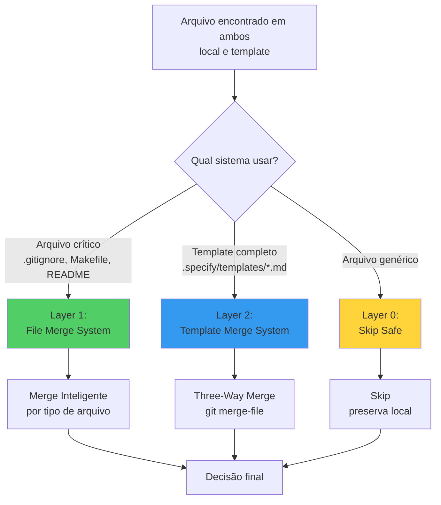
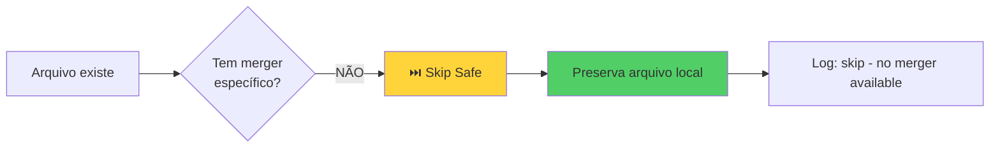
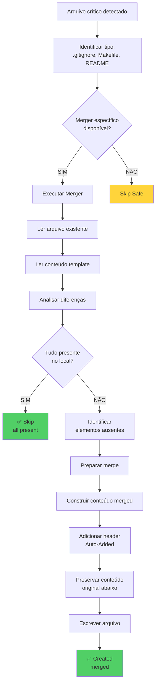
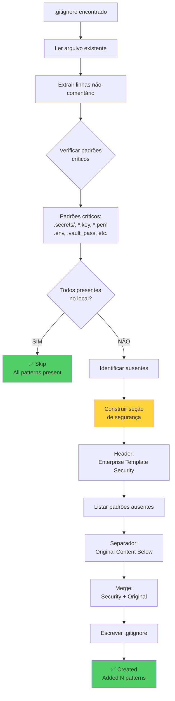
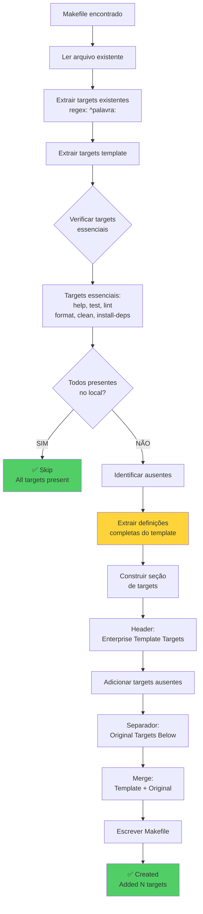
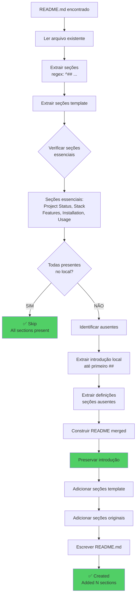
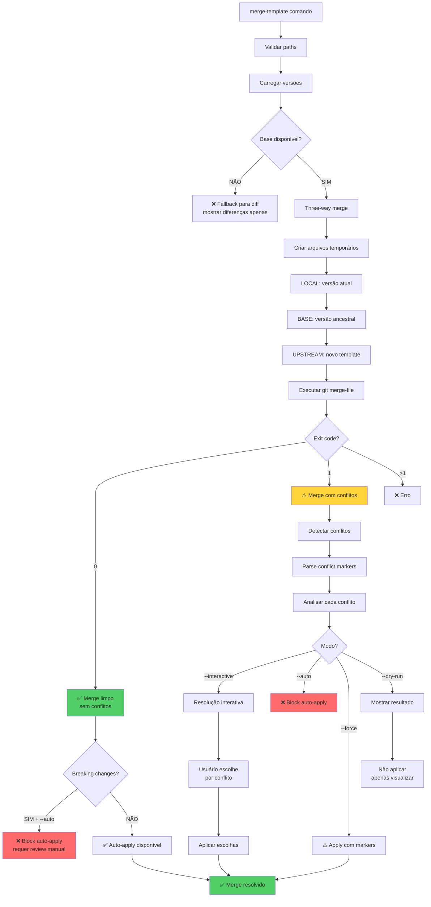

# 🔄 Project Update Decision Workflow

**Data**: 2026-05-11  
**Componente**: Scaffold Template Merge System  
**Objetivo**: Documentar lógica de decisão para atualização de arquivos quando há conflito de nomes

---

## 📋 Visão Geral

O sistema de **atualização de projetos** implementa uma arquitetura em **duas camadas** para decidir se sobrescreve ou não arquivos existentes durante merge/atualização de templates:

### Camada 1: File Merge System
Sistema de merge inteligente para **arquivos críticos específicos** (.gitignore, Makefile, README.md)

### Camada 2: Template Merge System  
Sistema de **three-way merge** para templates completos usando git merge-file

---

## 🎯 Cenário do Problema

```
Situação: Atualizar projeto existente com novo template

Projeto Local:                Template Upstream:
├── .gitignore (v1.0)        ├── .gitignore (v2.0)
├── Makefile (custom)        ├── Makefile (novos targets)
├── README.md (intro)        ├── README.md (novas seções)
└── src/                     └── src/

❓ QUESTÃO: O que fazer quando encontra .gitignore no projeto E no template?
```

---

## 🔀 Arquitetura de Decisão



---

## 🔍 Layer 0: Skip Safe (Fallback)

**Quando**: Arquivo genérico sem merger específico  
**Decisão**: ❌ **NÃO sobrescrever** (preserva local)



**Código**:
```python
def merge_or_skip(file_path: Path, template_content: str):
    # Tentar encontrar merger apropriado
    for merger in _MERGERS:
        if merger.can_merge(file_path):
            return merger.merge(file_path, template_content)
    
    # Sem merger → skip (comportamento seguro)
    return CreatedItem(
        path=file_path,
        status="skipped",
        message="File exists, no merger available"
    )
```

**Exemplos**:
- `config.json` → ⏭️ Skip (preserva config do usuário)
- `custom.py` → ⏭️ Skip (preserva código custom)
- `notes.txt` → ⏭️ Skip (preserva documentação local)

---

## 🔍 Layer 1: File Merge System

**Quando**: Arquivos críticos específicos (.gitignore, Makefile, README)  
**Decisão**: ✅ **Merge inteligente** com preservação de customizações

### 📊 Fluxo de Decisão Geral



---

### 1️⃣ GitignoreMerger — Segurança (P0 CRITICAL)

**Estratégia**: Adicionar padrões de segurança ausentes sem duplicar



**Algoritmo**:
```python
def merge_gitignore(existing_path, template_content):
    # 1. Ler existente
    existing_lines = set(line for line in existing.splitlines() 
                        if line and not line.startswith("#"))
    
    # 2. Detectar ausentes
    missing = [p for p in CRITICAL_PATTERNS if p not in existing_lines]
    
    # 3. Decisão
    if not missing:
        return skip("All patterns present")
    
    # 4. Merge
    security_section = f"""
# === Enterprise Template Security (Auto-Added) ===
# CRITICAL: Never commit credentials
{"\n".join(missing)}

# === Original Content Below ===
"""
    
    merged = security_section + existing_content
    
    # 5. Sobrescrever com merge
    existing_path.write_text(merged)
    
    return created(f"Added {len(missing)} patterns")
```

**Exemplo Real**:
```diff
Antes (.gitignore local):
  node_modules/
  dist/
  .env

Depois (merged):
+ # === Enterprise Template Security (Auto-Added) ===
+ # CRITICAL: Never commit credentials
+ # Added: 2026-05-11 14:30:00
+ .secrets/
+ *.key
+ *.pem
+ .vault_pass
+ *secret*
+ *password*
+ *token*
+ 
+ # === Original Content Below ===
  node_modules/
  dist/
  .env
```

**Decisão**: ✅ **Sobrescrever** com conteúdo merged (segurança adicionada + original preservado)

---

### 2️⃣ MakefileMerger — Workflow (P1 IMPORTANT)

**Estratégia**: Adicionar targets ausentes preservando customizações



**Algoritmo**:
```python
def merge_makefile(existing_path, template_content):
    # 1. Extrair targets
    target_pattern = re.compile(r'^([a-zA-Z0-9_-]+):', re.MULTILINE)
    existing_targets = set(target_pattern.findall(existing_content))
    
    # 2. Detectar ausentes
    missing = [t for t in ESSENTIAL_TARGETS if t not in existing_targets]
    
    # 3. Decisão
    if not missing:
        return skip("All targets present")
    
    # 4. Extrair definições completas
    missing_definitions = []
    for target in missing:
        pattern = re.compile(rf'^({target}:.*?)(?=^\S|\Z)', re.MULTILINE | re.DOTALL)
        match = pattern.search(template_content)
        if match:
            missing_definitions.append(match.group(1))
    
    # 5. Merge
    template_section = f"""
# === Enterprise Template Targets (Auto-Added) ===
{"\n\n".join(missing_definitions)}

# === Original Targets Below ===
"""
    
    merged = template_section + existing_content
    existing_path.write_text(merged)
    
    return created(f"Added {len(missing)} targets")
```

**Exemplo Real**:
```diff
Antes (Makefile local):
  build:
  	npm run build
  
  deploy:
  	./deploy.sh

Depois (merged):
+ # === Enterprise Template Targets (Auto-Added) ===
+ help:  ## Show available commands
+ 	@grep -E '^[a-zA-Z_-]+:.*?## .*$$' $(MAKEFILE_LIST)
+ 
+ test:  ## Run tests
+ 	npm test
+ 
+ lint:  ## Run linter
+ 	npm run lint
+ 
+ # === Original Targets Below ===
  build:
  	npm run build
  
  deploy:
  	./deploy.sh
```

**Decisão**: ✅ **Sobrescrever** com merge (targets template + targets custom preservados)

---

### 3️⃣ ReadmeMerger — Documentação (P1 IMPORTANT)

**Estratégia**: Adicionar seções ausentes preservando introdução do usuário



**Algoritmo**:
```python
def merge_readme(existing_path, template_content):
    # 1. Extrair seções
    section_pattern = re.compile(r'^## (.+?)$', re.MULTILINE)
    existing_sections = set(section_pattern.findall(existing_content))
    
    # 2. Detectar ausentes
    missing = [s for s in ESSENTIAL_SECTIONS if s not in existing_sections]
    
    # 3. Decisão
    if not missing:
        return skip("All sections present")
    
    # 4. Extrair introdução preservada
    intro_match = re.match(r'^(.*?)(?=^##|\Z)', existing_content, re.DOTALL)
    intro = intro_match.group(1).rstrip() if intro_match else ""
    
    # 5. Extrair definições de seções ausentes
    missing_definitions = []
    for section in missing:
        pattern = re.compile(rf'^(## {re.escape(section)}.*?)(?=^##|\Z)', 
                            re.MULTILINE | re.DOTALL)
        match = pattern.search(template_content)
        if match:
            missing_definitions.append(match.group(1))
    
    # 6. Merge
    merged = intro + "\n\n---\n\n"
    merged += "<!-- Enterprise Template Sections (Auto-Added) -->\n\n"
    merged += "\n\n".join(missing_definitions)
    merged += "\n\n---\n\n<!-- Original Sections Below -->\n\n"
    
    # Adicionar seções originais
    original_sections = re.search(r'^##.*', existing_content, re.MULTILINE | re.DOTALL)
    if original_sections:
        merged += original_sections.group(0)
    
    existing_path.write_text(merged)
    
    return created(f"Added {len(missing)} sections")
```

**Exemplo Real**:
```diff
Antes (README.md local):
  # My Awesome Project
  
  This is my cool project that does X, Y, Z.
  
  ## Custom Section
  My custom notes here.

Depois (merged):
  # My Awesome Project
  
  This is my cool project that does X, Y, Z.
  
  ---
  
+ <!-- Enterprise Template Sections (Auto-Added) -->
+ 
+ ## Project Status
+ 
+ Current version: 1.0.0
+ Status: Active Development
+ 
+ ## Stack
+ 
+ - Node.js 18+
+ - TypeScript 5.0
+ 
+ ## Features
+ 
+ - Feature A
+ - Feature B
+ 
+ ## Installation
+ 
+ ```bash
+ npm install
+ ```
+ 
+ ## Usage
+ 
+ ```bash
+ npm start
+ ```
  
  ---
  
  <!-- Original Sections Below -->
  
  ## Custom Section
  My custom notes here.
```

**Decisão**: ✅ **Sobrescrever** com merge (intro preservada + seções template + seções custom)

---

## 🔍 Layer 2: Template Merge System

**Quando**: Templates completos em `.specify/templates/*.md`  
**Decisão**: ✅ **Three-way merge** usando git merge-file

### 📊 Fluxo Three-Way Merge



---

### Algoritmo Three-Way Merge

```python
def merge_templates(local_path, upstream_path, base_content):
    """
    Perform three-way merge using git merge-file.
    
    Processo:
    1. Criar 3 arquivos temporários: LOCAL, BASE, UPSTREAM
    2. Executar: git merge-file -p --diff3 LOCAL BASE UPSTREAM
    3. Analisar exit code:
       - 0: merge limpo (sem conflitos)
       - 1: merge com conflitos
       - >1: erro fatal
    4. Decisão baseada em conflitos e flags
    """
    
    # 1. Criar arquivos temporários
    with tempfile.NamedTemporaryFile() as local_tmp, \
         tempfile.NamedTemporaryFile() as base_tmp, \
         tempfile.NamedTemporaryFile() as upstream_tmp:
        
        local_tmp.write(local_path.read_bytes())
        base_tmp.write(base_content.encode())
        upstream_tmp.write(upstream_path.read_bytes())
        
        # 2. Executar git merge-file
        result = subprocess.run([
            "git", "merge-file",
            "-p",              # Output to stdout
            "--diff3",         # Show base in conflicts
            "-L", "LOCAL",
            "-L", "BASE",
            "-L", "UPSTREAM",
            local_tmp.name,
            base_tmp.name,
            upstream_tmp.name
        ], capture_output=True)
        
        merged_content = result.stdout.decode()
        has_conflicts = result.returncode == 1
        
        # 3. Analisar resultado
        if result.returncode > 1:
            return MergeResult(
                success=False,
                error_message="git merge-file failed"
            )
        
        # 4. Detectar e classificar conflitos
        conflicts = detect_conflicts(merged_content) if has_conflicts else []
        
        return MergeResult(
            success=True,
            merged_content=merged_content,
            has_conflicts=has_conflicts,
            conflicts=conflicts
        )
```

---

### Detecção e Classificação de Conflitos

```mermaid
flowchart TD
    A[Merged content com markers] --> B[Parse conflict markers]
    B --> C[Encontrar blocos:<br/><<<<<<< LOCAL<br/>...<br/>|||||||  BASE<br/>...<br/>=======<br/>...<br/>>>>>>>> UPSTREAM]
    
    C --> D{Analisar conteúdo<br/>de cada seção}
    
    D --> E{BASE vazio?}
    E -->|SIM| F{LOCAL vazio?}
    E -->|NÃO| G{LOCAL e UPSTREAM<br/>ambos modificados?}
    
    F -->|SIM + UPSTREAM tem| H[upstream_added<br/>novo conteúdo upstream]
    F -->|NÃO + UPSTREAM vazio| I[local_added<br/>customização local]
    F -->|NÃO + UPSTREAM tem| J[both_added<br/>ambos adicionaram]
    
    G -->|SIM| K[both_modified<br/>conflito real]
    G -->|NÃO + LOCAL vazio| L[upstream_added]
    G -->|NÃO + UPSTREAM vazio| M[local_added]
    
    H --> N[Gerar sugestão]
    I --> N
    J --> N
    K --> N
    L --> N
    M --> N
    
    N --> O[Conflict com metadata]
    
    style H fill:#339af0
    style I fill:#51cf66
    style J fill:#ffd43b
    style K fill:#ff6b6b
```

**Código de Classificação**:
```python
def classify_conflict(local_content, base_content, upstream_content):
    """
    Classifica tipo de conflito para sugestão inteligente.
    """
    if not base_content:
        # Não havia conteúdo no base
        if not local_content:
            return "upstream_added"  # Só upstream adicionou
        elif not upstream_content:
            return "local_added"     # Só local adicionou
        else:
            return "both_added"      # Ambos adicionaram (raro)
    
    elif not local_content:
        return "upstream_added"      # Local deletou, upstream modificou
    
    elif not upstream_content:
        return "local_added"         # Local modificou, upstream deletou
    
    else:
        return "both_modified"       # Conflito real - ambos modificaram
```

---

### Sugestões de Resolução por Tipo

| Tipo de Conflito | Sugestão | Ação Recomendada |
|------------------|----------|------------------|
| **both_modified** | Ambos modificaram | 🔍 Review manual cuidadoso |
| **local_added** | Customização local | ✅ **Keep local** (preservar) |
| **upstream_added** | Nova feature upstream | ✅ **Accept upstream** (aplicar) |
| **both_added** | Ambos adicionaram | ⚠️ Review para mesclar ambos |

```python
def suggest_resolution(conflict_type):
    """
    Gera sugestão de resolução baseada no tipo de conflito.
    """
    suggestions = {
        "both_modified": (
            "Both local and upstream modified this section.\n"
            "Review carefully and choose the best combination."
        ),
        "local_added": (
            "Local customization not present in upstream.\n"
            "Recommendation: Keep local content (your customization)."
        ),
        "upstream_added": (
            "New content from upstream not in local.\n"
            "Recommendation: Accept upstream content (new feature)."
        ),
        "both_added": (
            "Both added content in same location.\n"
            "Review to determine if both should be kept."
        ),
    }
    return suggestions.get(conflict_type, "Unknown conflict type")
```

---

## 📊 Matriz Completa de Decisão

### Layer 0: Skip Safe

| Arquivo | Tem Merger? | Decisão | Resultado |
|---------|-------------|---------|-----------|
| config.json | ❌ Não | ⏭️ Skip | Preserva local |
| custom.py | ❌ Não | ⏭️ Skip | Preserva local |
| notes.txt | ❌ Não | ⏭️ Skip | Preserva local |

---

### Layer 1: File Merge System

| Arquivo | Merger | Elementos Ausentes? | Decisão | Resultado |
|---------|--------|---------------------|---------|-----------|
| .gitignore | GitignoreMerger | ❌ Não | ⏭️ Skip | Todos padrões presentes |
| .gitignore | GitignoreMerger | ✅ 3 patterns | ✅ Merge | Adiciona 3 + preserva original |
| Makefile | MakefileMerger | ❌ Não | ⏭️ Skip | Todos targets presentes |
| Makefile | MakefileMerger | ✅ 2 targets | ✅ Merge | Adiciona 2 + preserva custom |
| README.md | ReadmeMerger | ❌ Não | ⏭️ Skip | Todas seções presentes |
| README.md | ReadmeMerger | ✅ 4 seções | ✅ Merge | Adiciona 4 + preserva intro/custom |

---

### Layer 2: Template Merge System

| Situação | Base? | Conflitos? | Flags | Decisão | Resultado |
|----------|-------|------------|-------|---------|-----------|
| Merge limpo | ✅ | ❌ Não | --auto | ✅ Apply | Sobrescreve com merge |
| Merge limpo | ✅ | ❌ Não | *default* | ✅ Apply | Sobrescreve com merge |
| Merge limpo + Breaking | ✅ | ❌ Não | --auto | ❌ Block | Requer review manual |
| Merge limpo + Breaking | ✅ | ❌ Não | --force | ✅ Apply | Sobrescreve com merge |
| Com conflitos | ✅ | ✅ Sim | --auto | ❌ Block | Não aplica |
| Com conflitos | ✅ | ✅ Sim | --interactive | 🔧 Interactive | Usuário resolve |
| Com conflitos | ✅ | ✅ Sim | --force | ⚠️ Apply | Aplica com markers |
| Com conflitos | ✅ | ✅ Sim | --dry-run | 📄 Show | Não aplica |
| Sem base | ❌ | N/A | *any* | 📊 Diff | Mostra diff apenas |

---

## 🎯 Exemplos Práticos Completos

### Exemplo 1: .gitignore com Padrões Ausentes

**Contexto**:
```bash
# Comando
scaffold.py new backend-api --profile python-fastapi

# Situação
.gitignore já existe no projeto
```

**Análise**:
```python
# 1. Layer 0: Tem merger específico?
→ SIM: GitignoreMerger pode processar .gitignore

# 2. Layer 1: GitignoreMerger executa
existing_lines = {
    "node_modules/",
    "dist/",
    ".env"
}

CRITICAL_PATTERNS = [
    ".secrets/", "*.key", "*.pem", 
    ".vault_pass", "*secret*", etc.
]

missing_patterns = [
    ".secrets/", "*.key", "*.pem",
    ".vault_pass", "*secret*", ...
]  # 5 padrões ausentes

# 3. Decisão: missing_patterns não vazio
→ Merge necessário
```

**Ação**:
```python
# Construir merge
security_section = """
# === Enterprise Template Security (Auto-Added) ===
# CRITICAL: Never commit credentials
# Added: 2026-05-11 14:30:00
.secrets/
*.key
*.pem
.vault_pass
*secret*

# === Original Content Below ===
"""

merged = security_section + existing_content

# Sobrescrever arquivo
existing_path.write_text(merged)
```

**Resultado**: ✅ **Sobrescreve** com conteúdo merged (segurança + original)

---

### Exemplo 2: Template Markdown com Conflitos

**Contexto**:
```bash
# Comando
scaffold.py merge-template spec-template.md --interactive

# Versões
Local:    v1.0.0
Upstream: v2.0.0
Base:     v1.0.0
```

**Análise**:
```python
# 1. Layer 2: Template Merge System
→ Template completo (.md)
→ Base disponível (v1.0.0)

# 2. Three-way merge
LOCAL:    "## Title\nMy custom intro\n## Section A"
BASE:     "## Title\nDefault intro\n## Section A"
UPSTREAM: "## Title\nImproved intro\n## Section A\n## Section B"

# 3. git merge-file resultado
EXIT CODE: 1 (conflitos)

MERGED:
## Title
<<<<<<< LOCAL
My custom intro
||||||| BASE
Default intro
=======
Improved intro
>>>>>>> UPSTREAM
## Section A
## Section B

# 4. Detectar conflitos
conflicts = [
    ConflictRegion(
        start_line=1,
        end_line=7,
        local_content="My custom intro",
        upstream_content="Improved intro",
        region_type="both_modified"  # Ambos modificaram
    )
]
```

**Decisão Interativa**:
```
🔍 Conflict 1/1 (both_modified)

Lines 1-7:

LOCAL (your version):
  My custom intro

UPSTREAM (new version):
  Improved intro

Suggestion: Both local and upstream modified this section.
Review carefully and choose the best combination.

Choose:
[1] Keep local (your version)
[2] Accept upstream (new version)
[3] Edit manually
[4] Keep both

User selects: [3] Edit manually

User edits:
  My custom intro with improved style

Resolution applied.
```

**Resultado**: ✅ **Sobrescreve** com resolução do usuário

---

### Exemplo 3: Arquivo Sem Merger (Skip Safe)

**Contexto**:
```bash
# Comando
scaffold.py new backend-api --profile python-fastapi

# Situação
config/database.json já existe no projeto
```

**Análise**:
```python
# 1. Layer 0: Tem merger específico?
file_path = Path("config/database.json")

for merger in _MERGERS:  # [GitignoreMerger, MakefileMerger, ReadmeMerger]
    if merger.can_merge(file_path):
        ...

→ NÃO: Nenhum merger pode processar .json

# 2. Decisão: Skip Safe (fallback)
→ Preservar arquivo local (comportamento seguro)
```

**Ação**:
```python
return CreatedItem(
    path=file_path,
    kind="file",
    status="skipped",
    message="File exists, no merger available"
)
```

**Resultado**: ⏭️ **Skip** - arquivo local preservado intacto

---

## 🧪 Validação com Testes

### Testes File Merge System

| Teste | Cenário | Resultado Esperado | Status |
|-------|---------|-------------------|--------|
| test_gitignore_all_present | Todos padrões presentes | Skip | ✅ |
| test_gitignore_missing_patterns | 3 padrões ausentes | Merge com 3 adições | ✅ |
| test_makefile_all_targets | Todos targets presentes | Skip | ✅ |
| test_makefile_missing_targets | 2 targets ausentes | Merge com 2 adições | ✅ |
| test_readme_all_sections | Todas seções presentes | Skip | ✅ |
| test_readme_missing_sections | 4 seções ausentes | Merge com 4 adições | ✅ |
| test_generic_file_no_merger | Arquivo .json sem merger | Skip safe | ✅ |

### Testes Template Merge System

| Teste | Cenário | Resultado Esperado | Status |
|-------|---------|-------------------|--------|
| test_merge_clean_no_conflicts | Merge limpo | Apply automático | ✅ |
| test_merge_with_conflicts | Com conflitos | Detectar e classificar | ✅ |
| test_merge_breaking_auto_blocked | Breaking + --auto | Block auto-apply | ✅ |
| test_merge_interactive_resolution | --interactive | Resolve conflitos | ✅ |
| test_merge_no_base_fallback | Sem base | Fallback para diff | ✅ |

---

## 🎓 Princípios de Design

### 1. Segurança em Primeiro Lugar
- **Skip Safe**: Quando em dúvida, preserva local
- **Merge Aditivo**: Nunca remove conteúdo do usuário
- **Backup Automático**: Templates críticos têm backup antes de merge

### 2. Preservação de Customizações
- **Merge Inteligente**: Adiciona ausentes, preserva existentes
- **Three-Way Merge**: Usa base para detectar o que mudou onde
- **Conflict Detection**: Identifica conflitos reais vs. adições paralelas

### 3. Transparência
- **Headers Explícitos**: Seções auto-adicionadas são marcadas
- **Logging Detalhado**: Todas decisões são registradas
- **Dry-Run**: Visualizar resultado antes de aplicar

### 4. Controle do Usuário
- **Interactive Mode**: Usuário resolve conflitos manualmente
- **Force Flag**: Aplicar mesmo com conflitos (expert mode)
- **Auto Flag**: Aplicar apenas se limpo (CI/CD mode)

---

## 📝 Comandos e Flags

### File Merge (Automático)
```bash
# Merge automático durante scaffold
scaffold.py new backend-api --profile python-fastapi

# Mergers aplicados automaticamente:
# - .gitignore → GitignoreMerger
# - Makefile → MakefileMerger
# - README.md → ReadmeMerger
# - Outros → Skip safe
```

### Template Merge (Explícito)
```bash
# Merge limpo: aplica automaticamente
scaffold.py merge-template spec-template.md

# Com conflitos: resolução interativa
scaffold.py merge-template spec-template.md --interactive

# Auto-apply apenas se limpo
scaffold.py merge-template spec-template.md --auto

# Forçar aplicação mesmo com conflitos
scaffold.py merge-template spec-template.md --force

# Dry-run: apenas visualizar
scaffold.py merge-template spec-template.md --dry-run
```

---

## 🔗 Referências

### Código
- **File Merge**: `scripts/lib/file_merge.py`
- **Template Merge**: `scripts/lib/template_merge.py`
- **Merge Flow**: `scripts/lib/flows/merge_template.py`

### Documentação
- **IMP-65**: Template Synchronization System
- **BUG-#1**: File Merge System (P0 CRITICAL)
- **BUG-04**: Breaking Changes Protection

### Testes
- `tests/test_file_merge.py` (file merge system)
- `tests/test_template_merge.py` (template merge system)
- `tests/test_merge_integration.py` (integration tests)

---

## ✅ Resumo Executivo

### Quando NÃO sobrescreve (Skip)?
1. ✅ Arquivo genérico sem merger específico → **Skip Safe**
2. ✅ Arquivo crítico com todos elementos presentes → **Skip (já completo)**
3. ✅ Template merge com conflitos + flag --auto → **Block**
4. ✅ Template merge sem base disponível → **Fallback para diff**

### Quando SOBRESCREVE com Merge?
1. ✅ .gitignore com padrões ausentes → **Merge aditivo**
2. ✅ Makefile com targets ausentes → **Merge aditivo**
3. ✅ README com seções ausentes → **Merge aditivo**
4. ✅ Template sem conflitos → **Three-way merge limpo**
5. ✅ Template com conflitos + --interactive → **Merge resolvido**
6. ✅ Template com conflitos + --force → **Merge com markers**

### Princípio Geral
> **"Adicione o que falta, preserve o que existe, pergunte em caso de conflito"**

**Comportamento padrão**: ⏭️ **Skip Safe** (quando em dúvida, preserva local)
