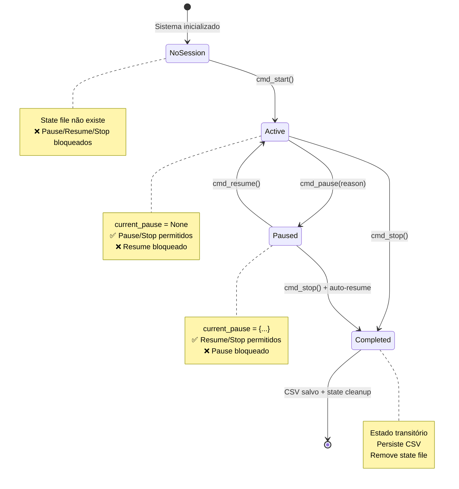
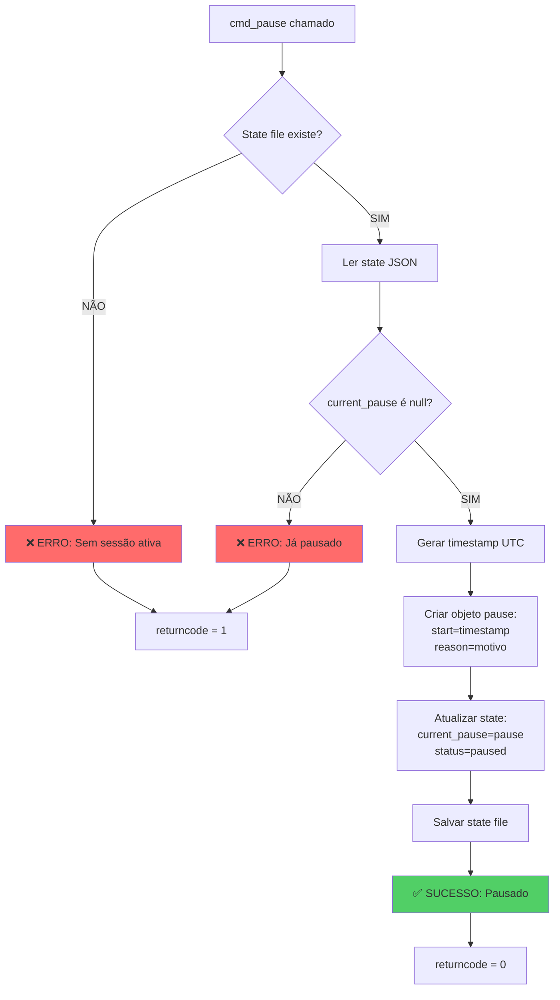
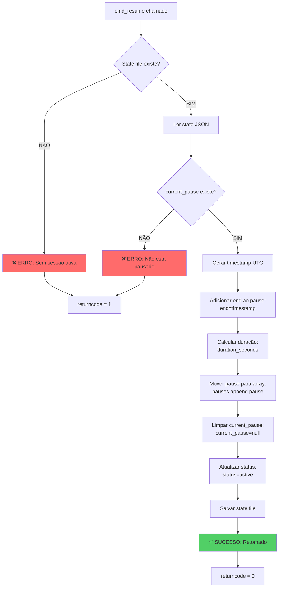
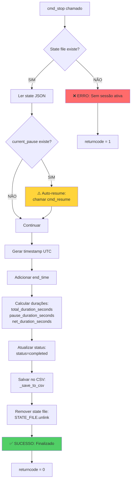
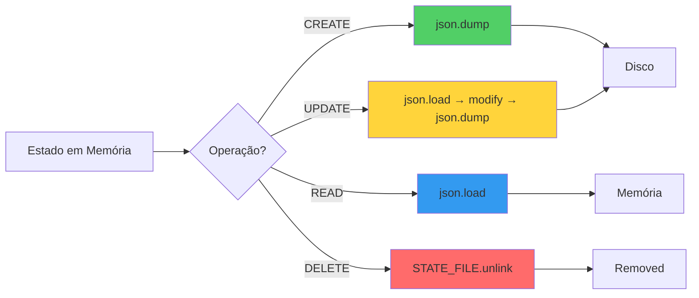
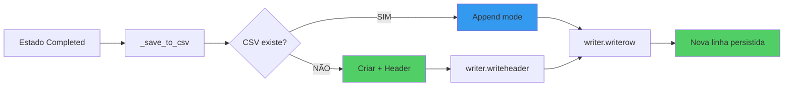
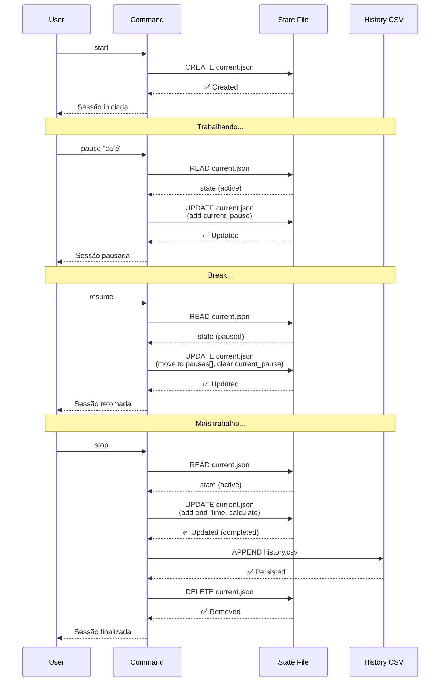

# 🔄 Time Tracker Decision Workflow

**Data**: 2026-05-11  
**Arquivo**: `scripts/session-time-tracker.py`  
**Objetivo**: Documentar lógica de decisão para análise de estado e atualização de arquivos

---

## 📋 Visão Geral

O session-time-tracker implementa uma **máquina de estados** que decide quando e como atualizar arquivos de estado (JSON) e histórico (CSV) baseado em verificações de pré-condições.

### Arquivos Gerenciados
- **State File**: `.session-time/current.json` (estado transitório)
- **History CSV**: `.session-time/history.csv` (histórico persistente)

### Estados Possíveis
1. **Sem sessão** — Nenhum arquivo de estado existe
2. **Active** — Sessão em andamento (working)
3. **Paused** — Sessão pausada temporariamente
4. **Completed** — Sessão finalizada (transitório antes de cleanup)

---

## 🔀 Diagrama de Estados



---

## 🧠 Lógica de Decisão por Comando

### 1️⃣ START — Iniciar Sessão

```mermaid
flowchart TD
    A[cmd_start chamado] --> B{State file existe?}
    B -->|SIM| C[❌ ERRO: Sessão já ativa]
    B -->|NÃO| D[Criar diretório .session-time/]
    D --> E[Gerar timestamp UTC]
    E --> F[Criar state JSON]
    F --> G[Campos iniciais:<br/>session_date<br/>start_time<br/>pauses=[]<br/>current_pause=null<br/>status=active]
    G --> H[Salvar state file]
    H --> I[✅ SUCESSO: Sessão iniciada]
    
    C --> J[returncode = 1]
    I --> K[returncode = 0]
    
    style C fill:#ff6b6b
    style I fill:#51cf66
```

**Lógica de Atualização**:
- ❌ **NÃO atualiza** se arquivo já existe (proteção duplo start)
- ✅ **CRIA novo** arquivo apenas se não existir

---

### 2️⃣ PAUSE — Pausar Sessão



**Lógica de Atualização**:
- ❌ **NÃO atualiza** se não há sessão
- ❌ **NÃO atualiza** se já está pausado
- ✅ **ATUALIZA** apenas se estado é `active`

**Campos Modificados**:
- `current_pause` ← novo objeto com start/reason
- `status` ← "paused"

---

### 3️⃣ RESUME — Retomar Sessão



**Lógica de Atualização**:
- ❌ **NÃO atualiza** se não há sessão
- ❌ **NÃO atualiza** se não está pausado
- ✅ **ATUALIZA** apenas se estado é `paused`

**Campos Modificados**:
- `current_pause["end"]` ← timestamp
- `current_pause["duration_seconds"]` ← calculado
- `pauses[]` ← append(current_pause)
- `current_pause` ← null
- `status` ← "active"

---

### 4️⃣ STOP — Finalizar Sessão



**Lógica de Atualização**:
- ❌ **NÃO atualiza** se não há sessão
- ⚠️ **AUTO-RESUME** se está pausado (recuperação automática)
- ✅ **ATUALIZA state** temporariamente (status=completed)
- ✅ **PERSISTE CSV** com histórico completo
- ✅ **REMOVE state** após persistir

**Campos Modificados (State)**:
- `end_time` ← timestamp
- `total_duration_seconds` ← calculado
- `pause_duration_seconds` ← sum(pauses)
- `net_duration_seconds` ← total - pause
- `status` ← "completed"

**Campos Salvos (CSV)**:
- `session_date`, `start_time`, `end_time`
- `total_duration` (HH:MM:SS)
- `pause_duration` (HH:MM:SS)
- `net_duration` (HH:MM:SS)
- `num_pauses` (count)
- `pause_details` (reason:duration; ...)

---

## 📊 Matriz de Decisão de Atualização

| Comando | State Existe? | Estado Atual | Current Pause? | Ação | Atualiza State? | Atualiza CSV? |
|---------|---------------|--------------|----------------|------|-----------------|---------------|
| **START** | ❌ Não | - | - | ✅ Cria novo | ✅ SIM (create) | ❌ NÃO |
| **START** | ✅ Sim | Qualquer | Qualquer | ❌ Erro | ❌ NÃO | ❌ NÃO |
| **PAUSE** | ❌ Não | - | - | ❌ Erro | ❌ NÃO | ❌ NÃO |
| **PAUSE** | ✅ Sim | Active | ❌ Não | ✅ Pausa | ✅ SIM (update) | ❌ NÃO |
| **PAUSE** | ✅ Sim | Paused | ✅ Sim | ❌ Erro | ❌ NÃO | ❌ NÃO |
| **RESUME** | ❌ Não | - | - | ❌ Erro | ❌ NÃO | ❌ NÃO |
| **RESUME** | ✅ Sim | Active | ❌ Não | ❌ Erro | ❌ NÃO | ❌ NÃO |
| **RESUME** | ✅ Sim | Paused | ✅ Sim | ✅ Retoma | ✅ SIM (update) | ❌ NÃO |
| **STOP** | ❌ Não | - | - | ❌ Erro | ❌ NÃO | ❌ NÃO |
| **STOP** | ✅ Sim | Active | ❌ Não | ✅ Finaliza | ✅ SIM (temp) | ✅ SIM (persist) |
| **STOP** | ✅ Sim | Paused | ✅ Sim | ⚠️ Auto-resume → Finaliza | ✅ SIM (temp) | ✅ SIM (persist) |

---

## 🔐 Proteções Implementadas

### 1. Proteção contra Duplo Start
```python
if STATE_FILE.exists():
    print("❌ Sessão já em andamento. Use 'stop' para finalizar antes de iniciar nova.")
    return 1
```
**Decisão**: ❌ NÃO cria novo arquivo

---

### 2. Proteção contra Comandos sem Sessão
```python
if not STATE_FILE.exists():
    print("❌ Nenhuma sessão ativa. Use 'start' primeiro.")
    return 1
```
**Decisão**: ❌ NÃO atualiza nada

---

### 3. Proteção contra Duplo Pause
```python
if state.get("current_pause"):
    print("❌ Sessão já pausada. Use 'resume' para retomar.")
    return 1
```
**Decisão**: ❌ NÃO atualiza state

---

### 4. Proteção contra Resume sem Pause
```python
if not state.get("current_pause"):
    print("❌ Sessão não está pausada.")
    return 1
```
**Decisão**: ❌ NÃO atualiza state

---

### 5. Auto-Recovery em Stop
```python
if state.get("current_pause"):
    print("⚠️  Sessão ainda pausada. Retomando automaticamente antes de finalizar.")
    cmd_resume()
    with open(STATE_FILE, "r", encoding="utf-8") as f:
        state = json.load(f)
```
**Decisão**: ⚠️ ATUALIZA com auto-resume → depois finaliza

---

## 📂 Operações de Arquivo

### State File (.session-time/current.json)



### History CSV (.session-time/history.csv)



**Modo de Escrita**: `append` (preserva histórico completo)

---

## 🎯 Fluxo Completo de Uma Sessão



---

## 🧪 Validação de Testes

Todos os cenários de decisão foram testados em `test_session_time_tracker.py`:

| Teste | Cenário | Estado Esperado | Atualização |
|-------|---------|-----------------|-------------|
| test_01 | Start nova sessão | State criado | ✅ CREATE |
| test_02 | Start com sessão ativa | Erro retornado | ❌ BLOCKED |
| test_03 | Pause → Resume | Pause movido para array | ✅ UPDATE |
| test_04 | Múltiplas pausas | 3 pausas no array | ✅ UPDATE × 6 |
| test_05 | Stop com pausa | CSV persistido | ✅ PERSIST + DELETE |
| test_06 | Stop enquanto pausado | Auto-resume → CSV | ⚠️ AUTO + PERSIST |
| test_07 | Pause sem sessão | Erro retornado | ❌ BLOCKED |
| test_08 | Resume sem pause | Erro retornado | ❌ BLOCKED |
| test_09 | Duplo pause | Erro retornado | ❌ BLOCKED |
| test_10 | Stats | Leitura CSV | 🔍 READ-ONLY |
| test_11 | Workflow completo | 3 pausas + CSV | ✅ ALL OPERATIONS |

**Resultado**: ✅ 11/11 passed — Todas decisões validadas

---

## 📌 Resumo da Lógica

### Quando ATUALIZAR State File?
1. ✅ **START**: Criar novo (apenas se não existir)
2. ✅ **PAUSE**: Atualizar existente (apenas se active)
3. ✅ **RESUME**: Atualizar existente (apenas se paused)
4. ✅ **STOP**: Atualizar temporariamente → depois deletar

### Quando ATUALIZAR CSV?
- ✅ **Apenas no STOP**: Append nova linha com sessão completa
- ❌ **Nunca nos outros comandos**: CSV é histórico imutável (append-only)

### Princípios de Decisão
1. **Idempotência**: Comandos inválidos retornam erro sem side effects
2. **Estado Explícito**: Sempre verificar arquivo antes de modificar
3. **Proteção de Dados**: Validar pré-condições antes de atualizar
4. **Recuperação Automática**: Auto-resume no stop se necessário
5. **Persistência Segura**: CSV append-only, state transitório

---

## 🔗 Referências

- **Código**: `scripts/session-time-tracker.py`
- **Testes**: `tests/test_session_time_tracker.py`
- **Test Report**: `docs/SESSIONS/2026-05-11/TIME_TRACKER_TEST_REPORT_2026-05-11.md`
- **Integration**: `.github/agents/session-manager.agent.md`
