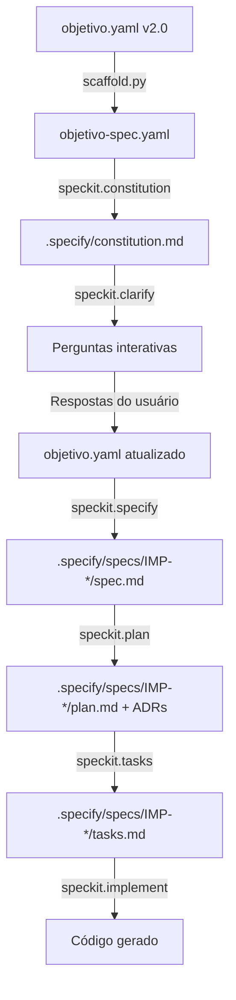

# 🎯 Objetivo: Migração de Dados Chatwoot

## 1️⃣ O que este projeto faz?

**Em uma frase**: Migra incrementalmente todos os dados de conversas, contatos e mensagens de uma instância Chatwoot (chat.vya.digital — descontinuada) para outra instância (synchat.vya.digital — mantida), garantindo zero perda de dados e integridade referencial completa.

**Contexto técnico**: Consolidação de duas bases PostgreSQL (`chatwoot_dev1_db` → `chatwoot004_dev1_db`) hospedadas no mesmo servidor (wfdb02.vya.digital), com remapeamento de IDs para evitar conflitos e preservação de todas as relações entre entidades (accounts → contacts → conversations → messages).

---

## 2️⃣ Qual problema resolve?

### Para quem?
- **Stakeholder principal**: Equipe de Operações Vya.Digital
- **Usuários afetados**: Time de atendimento que usa Chatwoot
- **Decision makers**: CTO + Head of Operations

### Qual a dor atual?
1. **Duplicação de dados**: Conversas distribuídas em 2 instâncias, dificultando busca histórica
2. **Custo operacional**: Manutenção de 2 containers Docker + 2 bases PostgreSQL
3. **Risco de perda**: Instância antiga (chat.vya.digital) será desativada em 60 dias

### Qual o resultado esperado?
- ✅ **100% dos dados** migrados para base destino (synchat.vya.digital)
- ✅ **Zero erros** de foreign key ou integridade referencial
- ✅ **Histórico preservado**: Todas conversas acessíveis após migração
- ✅ **Custo reduzido**: 1 instância Chatwoot em vez de 2

---

## 3️⃣ Escopo do Projeto

### ✅ O que ESTÁ incluído

**Migração de Dados**:
- Tabelas principais: `accounts`, `contacts`, `conversations`, `messages`
- Tabelas relacionadas: `inboxes`, `teams`, `labels`, `attachments`
- Relacionamentos (FK): Todas as foreign keys preservadas após remapeamento de IDs
- Referências S3: URLs de anexos migradas (arquivos físicos permanecem no S3)

**Validação e Integridade**:
- Pré-validação: Verificar schema versions das 2 instâncias
- Remapeamento de IDs: Calcular offset (max_id_destino + 1) para evitar conflitos
- Pós-validação: Relatório de contagem origem vs destino por tabela
- Idempotência: Re-execução não duplica registros

**Segurança**:
- Mascaramento: Dados sensíveis (emails, nomes, conteúdo) NÃO aparecem em logs
- Credenciais: Lidas exclusivamente de `.secrets/generate_erd.json`
- Auditoria: Log de todas operações sem expor PII

### ❌ O que NÃO está incluído

**Fora do Escopo**:
- ❌ Alteração de código do Chatwoot (projeto 100% independente)
- ❌ Movimentação física de arquivos S3 (apenas URLs migradas)
- ❌ Migração de configurações/webhooks (apenas dados de negócio)
- ❌ Downtime da aplicação (migração não afeta produção)

**Não Responsabilidades**:
- Backup da base destino → responsabilidade do DBA (feito antes da execução)
- Decisão sobre destino da base origem após migração → pendente (task D2)

---

## 4️⃣ Restrições e Requisitos Não-Funcionais

### Segurança 🔒

**Classificação de Dados**: **CONFIDENCIAL** (dados de clientes, conversas privadas)

**Requisitos obrigatórios**:
- [ ] Dados sensíveis mascarados em todos os logs (stdout + arquivo)
- [ ] Credenciais PostgreSQL nunca impressas ou versionadas
- [ ] Arquivo `.secrets/generate_erd.json` em `.gitignore`
- [ ] Zero exposição de emails, nomes, conteúdo de mensagens, telefones

**Padrões de segurança**:
- Seguir LGPD (Lei Geral de Proteção de Dados)
- Princípio do menor privilégio (conexão read-only na origem)
- Criptografia em trânsito (SSL/TLS para PostgreSQL)

### Infraestrutura 🏗️

**Onde roda**:
- **Execução**: Computador local do operador (não servidor)
- **Banco de dados**: wfdb02.vya.digital (PostgreSQL 14+)
- **Aplicações Chatwoot**: wf001.vya.digital (containers Docker)

**Dependências externas**:
- PostgreSQL client libraries (psycopg2)
- SQLAlchemy + Alembic para ORM e migrations
- Acesso SSH ao servidor wfdb02 (credenciais em `.secrets/`)

### Performance ⚡

**Metas de performance**:
- Migração completa: **< 2 horas** (estimativa para ~50k mensagens)
- Throughput: **≥ 500 registros/segundo** (insert bulk)
- Validação final: **< 10 minutos**

**Otimizações necessárias**:
- Bulk inserts (não insert individual)
- Disable triggers temporariamente (se possível)
- Commit em batches (1000 registros)

### Qualidade de Código 📐

**Padrões obrigatórios**:
- [ ] **Fabric Design Pattern** em TODO o código (modular, sem "código espaguete")
- [ ] **Linting**: Ruff (configurado em `pyproject.toml`)
- [ ] **Formatting**: Black (linha 88 caracteres)
- [ ] **Type hints**: MyPy strict mode
- [ ] **Docstrings**: reStructuredText com doctests (quando possível)
- [ ] **Tests**: Coverage ≥ 80% (pytest + pytest-cov)

**Estrutura de pastas** (ver ## 6️⃣ Estrutura de Pastas para detalhes):
```
src/
├── migrators/         # Classes de migração por tabela
├── validators/        # Validação de integridade
├── security/          # Mascaramento de dados sensíveis
└── utils/             # DB connection, logging, etc
```

---

## 5️⃣ Regras de Negócio

### Regra #1: Validação de Clientes Ativos

**Cenário**: Cliente (account) existe em ambas as bases

**Condições**:
1. **Se cliente INATIVO na base destino**:
   - ✅ Sobrepor todos os dados da origem (atualizar registro)
   - ✅ Migrar todas conversas/mensagens relacionadas

2. **Se cliente ATIVO em ambas as bases**:
   - ⚠️ **NÃO migrar automaticamente** (risco de conflito)
   - ⚠️ Gerar relatório detalhado: `reports/conflitos_clientes_ativos.csv`
   - ⚠️ Campos no relatório: account_id (origem), account_id (destino), email, status, última_atividade

**Output esperado**: CSV com 0 conflitos (ideal) ou lista para análise manual

### Regra #2: Remapeamento de IDs

**Problema**: IDs da origem podem colidir com IDs da base destino

**Solução**:
1. Calcular `offset = max(id_destino) + 1` para cada tabela
2. Aplicar offset em TODOS os IDs da origem: `new_id = old_id + offset`
3. Atualizar TODAS as foreign keys para referenciar novos IDs

**Exemplo**:
```
Origem: message_id=100 → conversation_id=50
Destino: max(message_id)=5000, max(conversation_id)=3000

Offset: message_offset=5001, conversation_offset=3001

Migração:
  message_id: 100 → 5101
  conversation_id: 50 → 3051
  FK: message.conversation_id = 3051 (corrigida!)
```

### Regra #3: Idempotência

**Requisito**: Re-executar migração não deve duplicar dados

**Implementação**:
- Tabela de controle: `migration_state` (criada na base destino)
- Registrar: `(tabela, id_origem, id_destino, migrated_at)`
- Antes de inserir: verificar se `id_origem` já migrado
- Se já migrado: **SKIP** (não inserir novamente)

---

## 6️⃣ Estrutura de Pastas

```
enterprise-chatwoot-migration/
├── .github/                    # CI/CD workflows (gerados automaticamente)
│   ├── workflows/
│   ├── prompts/                # Prompts Copilot customizados
│   └── copilot-instructions.md
│
├── .git-hooks/                 # Hooks Git personalizados
│   ├── pre-commit              # Ruff + Black + MyPy
│   └── commit-msg              # Conventional commits
│
├── .secrets/                   # ⚠️ NÃO VERSIONADO (em .gitignore)
│   └── generate_erd.json       # Credenciais PostgreSQL
│
├── .specify/                   # Configurações SpecKit (geradas)
│   ├── constitution.md
│   ├── specs/
│   └── templates/
│
├── .vscode/                    # Configurações VS Code (geradas)
│   ├── mcp.json                # MCP servers (memory, github, etc)
│   ├── settings.json
│   └── tasks.json
│
├── docs/                       # Documentação
│   ├── db_erd/
│   │   ├── chatwoot_dev1_db/   # ERD da base origem
│   │   └── chatwoot004_dev1_db/ # ERD da base destino
│   ├── architecture/           # ADRs e diagramas
│   └── SESSIONS/               # Documentação de sessões
│
├── reports/                    # Relatórios gerados pela migração
│   ├── conflitos_clientes_ativos.csv
│   ├── validacao_final.md
│   └── migration_summary.json
│
├── scripts/                    # Scripts de automação
│   ├── check_chatwoot_versions.py  # Validação de schemas
│   └── rollback_migration.py       # Rollback se necessário
│
├── src/                        # ⭐ Código-fonte principal
│   ├── __init__.py
│   ├── migrators/              # Migrators por tabela (Fabric Pattern)
│   │   ├── base.py             # BaseMigrator (classe abstrata)
│   │   ├── accounts.py         # AccountMigrator
│   │   ├── contacts.py         # ContactMigrator
│   │   ├── conversations.py    # ConversationMigrator
│   │   └── messages.py         # MessageMigrator
│   ├── validators/             # Validação de integridade
│   │   ├── schema_validator.py # Compara schemas origem/destino
│   │   └── fk_validator.py     # Valida foreign keys
│   ├── security/               # Segurança e mascaramento
│   │   ├── credential_loader.py # Lê .secrets/generate_erd.json
│   │   └── sensitive_masker.py  # Mascara PII em logs
│   └── utils/                  # Utilitários
│       ├── db_connector.py     # SQLAlchemy connection pools
│       ├── logger.py           # Logging com mascaramento
│       └── id_mapper.py        # Remapeamento de IDs
│
├── tests/                      # ⭐ Testes automatizados
│   ├── unit/                   # Testes unitários
│   │   ├── test_id_mapper.py
│   │   ├── test_sensitive_masker.py
│   │   └── test_validators.py
│   ├── integration/            # Testes de integração
│   │   └── test_migration_flow.py
│   └── fixtures/               # Dados de teste
│       └── sample_db.sql
│
├── tmp/                        # ⚠️ Arquivos temporários (não versionado)
│   └── migration_backup_*.sql
│
├── objetivo.yaml               # ⭐ Este arquivo! (input humano)
├── objetivo-spec.yaml          # Gerado pelo Copilot (output máquina)
├── mcp-questions.yaml          # Gerado pelo Copilot (configuração MCP)
├── pyproject.toml              # Dependências Python (Poetry/uv)
├── pytest.ini                  # Configuração pytest
├── Makefile                    # Comandos úteis (make migrate, make test)
└── README.md                   # Documentação principal
```

---

## 7️⃣ Tecnologias e Ferramentas

### Stack Principal

**Linguagem**: Python 3.11+

**Bibliotecas essenciais**:
- `sqlalchemy` — ORM e query builder
- `alembic` — Migrations e schema inspection
- `psycopg2-binary` — Driver PostgreSQL
- `pydantic` — Validação de dados e settings
- `rich` — Output formatado no terminal

**Ferramentas de qualidade**:
- `ruff` — Linting (substitui flake8 + isort + pyupgrade)
- `black` — Formatação automática
- `mypy` — Type checking
- `pytest` + `pytest-cov` — Testes e cobertura

**Documentação**:
- Docstrings: formato **reStructuredText**
- Doctests: incluídos onde possível (exemplos executáveis)
- Geração: Sphinx (opcional, se necessário HTML)

### Integração com SpecKit

**Workflow esperado** (automático após preencher este arquivo):



**Agents que processam este arquivo**:
- `speckit.constitution` — Extrai princípios do projeto (## 4️⃣ Restrições → constitution.md)
- `speckit.clarify` — Identifica campos vazios → faz perguntas
- `speckit.specify` — Gera spec.md técnica detalhada
- `speckit.plan` — Cria arquitetura e ADRs
- `speckit.tasks` — Gera checklist de implementação

---

## 8️⃣ Próximos Passos (Pós-Geração)

### Tasks Pendentes (a serem resolvidas)

**Task D1** ✅ **RESOLVIDO** (2026-04-09):
- **Descrição**: Verificar versão exata do Chatwoot nas 2 instâncias
- **Script**: `scripts/check_chatwoot_versions.py`
- **Resultado**:
  - `schema_sha1` idêntico (da6b4a366d...)
  - Origem: migration=20241217041352, total=252 migrations
  - Destino: migration=20240820191716, total=255 migrations
- **Conclusão**: Schemas compatíveis, migração viável

**Task D2** 🟡 **PENDENTE**:
- **Descrição**: Definir destino final de `chatwoot_dev1_db` após migração
- **Opções**:
  1. Manter histórico (read-only) por 90 dias
  2. Desativar completamente
  3. Congelar como backup frio (sem acesso)
- **Responsável**: @yvesmarinho (decisão de negócio)
- **Bloqueio**: Não bloqueia migração, mas afeta documentação pós-migração

### Validações Obrigatórias Pré-Migração

- [ ] Backup completo de `chatwoot004_dev1_db` criado e validado
- [ ] Acesso SSH ao wfdb02 testado e funcional
- [ ] Credenciais em `.secrets/generate_erd.json` validadas
- [ ] Espaço em disco suficiente no destino (calcular: tamanho_origem × 1.5)
- [ ] Todos os testes unitários passando (pytest)

### Critérios de Sucesso (Go-Live)

**Métricas obrigatórias**:
- ✅ Contagem de registros: `origem == destino` (por tabela)
- ✅ Validação FK: 0 erros de foreign key
- ✅ Relatório de conflitos: 0 clientes ativos duplicados OU lista para análise
- ✅ Performance: migração completa < 2 horas
- ✅ Segurança: 0 dados sensíveis em logs (auditoria manual)

**Aprovação final**: CTO + Head of Operations

---

## 9️⃣ Contexto Adicional

### Referências Externas

**Repositório Chatwoot** (apenas consulta, NÃO copiar código):
- URL: https://github.com/chatwoot/chatwoot
- Uso: Analisar migrations para entender evolução do schema
- Arquivos relevantes: `db/migrate/*.rb`

### Decisões Arquiteturais Iniciais

**Por que Fabric Design Pattern?**
- Evitar código espaguete em migração complexa
- Facilitar testes unitários (cada migrator isolado)
- Permitir execução paralela futura (se necessário)

**Por que não usar dump/restore do PostgreSQL?**
- Conflito de IDs inevitável (bases independentes)
- Necessidade de remapeamento de IDs
- Regras de negócio customizadas (clientes ativos)

**Por que Python e não SQL puro?**
- Lógica complexa (remapeamento, validação, mascaramento)
- Logging estruturado e audível
- Testes automatizados mais fáceis
- Reuso de código em futuras migrações

---

## 📝 Notas de Preenchimento

### Como preencher este arquivo?

**Este arquivo é SOMENTE INPUT HUMANO**. Você preenche até ## 9️⃣ Contexto Adicional, depois:
1. Salve como `objetivo.yaml` na raiz do projeto
2. Execute: `uv run scripts/scaffold.py --from-objetivo`
3. Copilot gera automaticamente: `objetivo-spec.yaml` (formato máquina)

**Não preencha**:
- ❌ Listas de features detalhadas → Copilot gera via speckit.specify
- ❌ Tasks de implementação → Copilot gera via speckit.tasks
- ❌ Profile descriptors → Copilot sugere automaticamente

**Seções obrigatórias** (P0):
- ✅ ## 1️⃣ O que este projeto faz?
- ✅ ## 2️⃣ Qual problema resolve?
- ✅ ## 3️⃣ Escopo do Projeto

**Seções opcionais** (P1-P2):
- ## 4️⃣ Restrições e Requisitos Não-Funcionais (preencher se houver requisitos específicos)
- ## 5️⃣ Regras de Negócio (preencher se houver lógica complexa)
- ## 6️⃣-9️⃣ Estrutura de Pastas / Tecnologias / Próximos Passos / Contexto (Copilot pode gerar)

### Dúvidas?

- 📖 Guia completo: `docs/guides/COMO_PREENCHER_OBJETIVO.md`
- 💬 Exemplos: `docs/templates/objetivo-examples/`
- 🤖 Pergunte ao Copilot: "Como preencho o campo X do objetivo.yaml?"

---

**Versão do Template**: objetivo.yaml v2.0 (2026-04-27)
**Schema**: https://github.com/vya-digital/default-project/schemas/objetivo-v2.json
**Licença**: MIT (Vya.Digital Internal Use)
